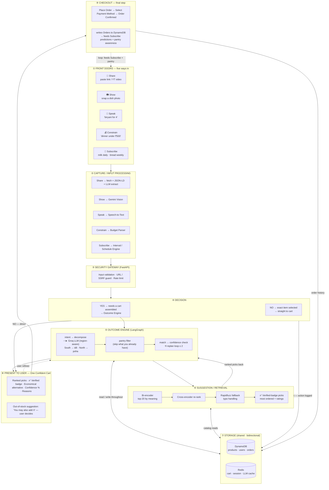

# NowCart — High-Level Architecture

---

## 1-minute walkthrough

| Layer | What you say |
|-------|-------------|
| ① Doors | "Five ways in — paste a link, snap a photo, speak, set a budget, or subscribe." |
| ② Capture | "Each door turns its input into structured intent — photo goes to Gemini, a link gets fetched and parsed, voice becomes text." |
| ③ Security | "Every input is validated and sanitised — malicious URLs are blocked here." |
| ④ Decision | "If the user already picked an exact item it goes straight to the cart. Otherwise the engine assembles one." |
| ⑤ Engine | "The engine decomposes the need with a region-aware LLM, filters pantry items you already own, then matches products." |
| ⑥ Retrieval | "Products are ranked by meaning using semantic search, re-ranked, and filtered by our Verified badge — most ordered + highest rated." |
| ⑦ Storage | "DynamoDB and Redis are read and written throughout — products, users, orders, cart state, and LLM cache." |
| ⑧ Present | "One confident cart: ranked picks with a Verified badge, an economical option, confidence scores, and reasons. Out-of-stock items are suggested — the user decides." |
| ⑨ Checkout | "Place order, select payment, confirmed. The order history loops back to feed Subscribe predictions and pantry awareness for next time." |
