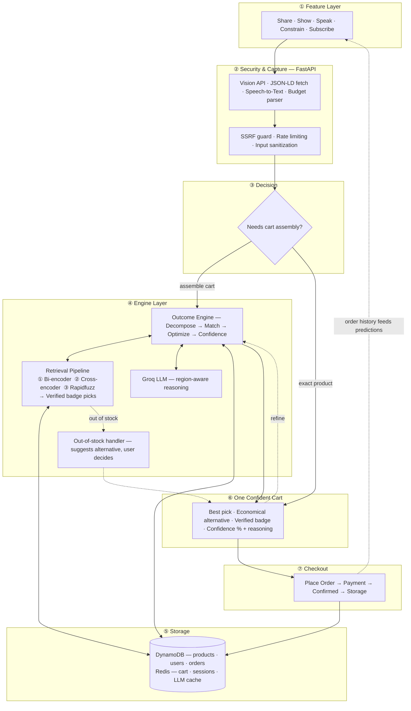

# NowCart

> Quick commerce solved delivery. We solve the deciding.

NowCart turns a plain need into a checkout-ready cart. Say a meal, snap a dish photo, paste a recipe link, set a budget, or let it predict your restock — one AI engine handles the rest.

**[Live App](https://d2hj5yrm8sue4v.cloudfront.net)** · Sign in as `rahul@gmail.com` (any password) for the full experience with order history and predictions.

---

## How it works

Five entry points, one reasoning engine:

| | Input | What the engine does |
|---|---|---|
| **Show** | Dish photo | Gemini Vision extracts ingredients → maps to catalog |
| **Share** | Recipe link or YouTube URL | Fetches + parses content → builds ingredient cart |
| **Speak** | Voice or text ("biryani for 4") | Decomposes intent → semantic + fuzzy match → confidence-scored cart |
| **Constrain** | Budget + headcount | Full pipeline → greedy knapsack trims to budget |
| **Subscribe** | Recurring items or nothing | Analyses order history → predicts restock before you ask |

Every cart returns a **recommended pick** and a **cheaper alternative** per item, with confidence scores and a NowCart Verified badge on the highest-rated, most-ordered products.

---

## Architecture

<details>
<summary>System diagram</summary>



</details>

---

## Stack

| Layer | Technology |
|---|---|
| Frontend | React 19 + Vite + TailwindCSS 4 · PWA (installable) |
| Backend | FastAPI + Pydantic 2 · Python 3.12 · fully async |
| AI / ML | LangGraph · Groq Llama 3.3 70B · Gemini 2.0 Flash · Bedrock Claude 3 Haiku · rapidfuzz |
| Database | DynamoDB (on-demand) |
| Cache | Redis — cart state, sessions, LLM response cache (1-hr TTL) |
| Infra | EC2 + Nginx · S3 + CloudFront · AWS ap-south-1 |
| CI/CD | GitHub Actions — push to `master` auto-deploys frontend to S3/CloudFront and backend to EC2 |

---

## Running locally

**Backend**

```bash
cd server
pip install -r requirements.txt

# No API keys needed — runs fully in-memory with mock LLM
uvicorn app.main:app --reload --port 8000
```

To use real AI, set these in `server/.env`:

```env
LLM_TEXT_PROVIDER=groq
LLM_VISION_PROVIDER=gemini
GROQ_API_KEY=...
GEMINI_API_KEY=...
DATA_BACKEND=memory        # or dynamodb
REDIS_URL=redis://localhost:6379/0
```

**Frontend**

```bash
cd client
npm install
npm run dev    # http://localhost:5173 — proxies /api → :8000
```

---

## Deployment

Push to `master` triggers the GitHub Actions pipeline:

1. Build frontend (`tsc + vite`) → sync to S3 → invalidate CloudFront
2. SSH into EC2 → `git pull` → `systemctl restart nowcart`

Required secrets: `AWS_ACCESS_KEY_ID`, `AWS_SECRET_ACCESS_KEY`, `EC2_HOST`, `EC2_USER`, `EC2_SSH_KEY`.

---

## Admin

Log in as `admin@nowcart.app` (any password) to see request volume, cart-build count, latency, error rate, LLM cache hit ratio, and infrastructure cost (currently $0 — free tier).
