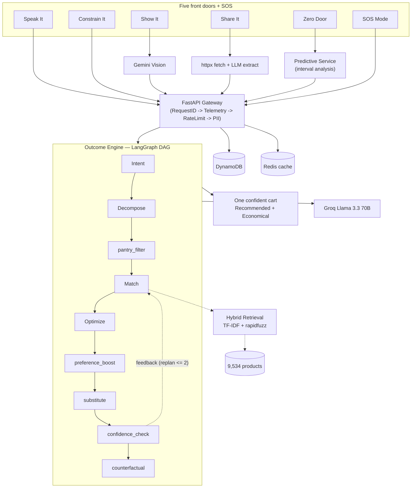
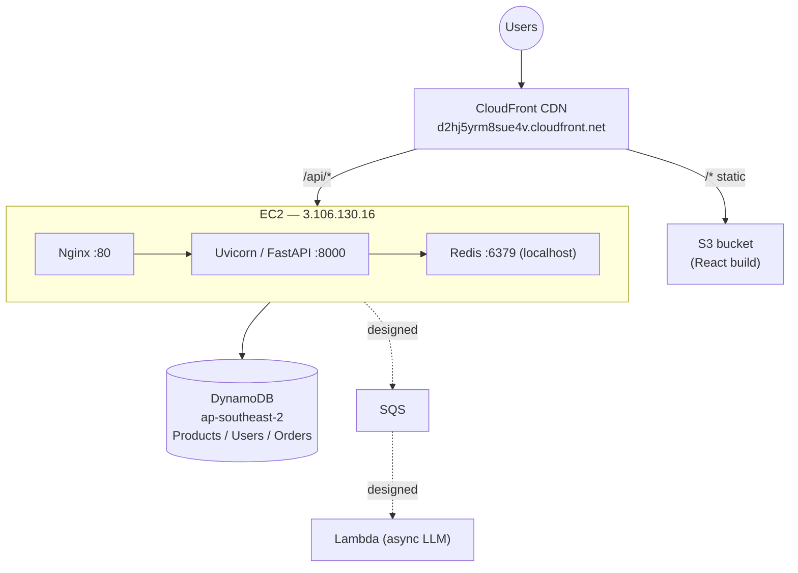

# NowCart

**The intent-capture layer for quick commerce.**

> *Quick commerce solved delivery. We solve the deciding.*

NowCart removes the search box from grocery shopping. Instead of typing product names one by one, users express a single outcome — say it, set a budget, snap a photo, share a link, or let the engine predict it — and an AI pipeline assembles **one confident, checkout-ready cart**, defends every choice with a confidence score, surfaces a cheaper alternative for each item, and handles out-of-stock substitutions transparently.

**Five ways in. One brain. One confident cart out.**

---

## Live Application

Deployed and running on AWS (S3 + CloudFront, EC2, DynamoDB):

**https://d2hj5yrm8sue4v.cloudfront.net**

---

## The Problem

Quick commerce solved *delivery* — groceries arrive in ten minutes. But customers still spend **8–12 minutes deciding** what to buy: searching each item, comparing variants, checking stock, substituting when something is unavailable, and second-guessing their choices. The bottleneck moved from the warehouse to the search box. There is no intelligence between *"I'm making biryani for four"* and a ready-to-checkout cart.

## The Solution

NowCart is the missing intelligence layer between a human need and fulfillment. It offers multiple front doors for expressing intent, all routing into one Outcome Engine:

| Front door | Input | Example |
|-----------|-------|---------|
| Speak It | Voice or text | "I'm making biryani for four" |
| Constrain It | Budget + headcount | "Rs. 1000, dinner for two tonight" |
| Show It | Photo of a dish | a plate of dal makhani |
| Share It | Recipe URL, YouTube link, or text | a YouTube recipe link, resolved to ingredients |
| Zero Door | Nothing | predicts your restock before you ask |
| SOS Mode | An emergency situation | "guests arriving in 30 minutes" |

Every input produces one confident cart with:

- Per-item confidence scores (for example, "97% confident")
- A one-line justification for each pick ("best match, in stock, you bought it before")
- A **Recommended** view and an **Economical** view with the savings shown
- Transparent out-of-stock substitutions with a full audit trail
- A human-in-the-loop gate when overall confidence falls below threshold
- Pantry awareness that skips items the user likely already has at home

---

## Key Features

### Outcome Engine (LangGraph multi-agent pipeline)

A ten-node directed graph with a conditional re-planning loop that turns natural language into a fully matched cart:

```
intent -> decompose -> pantry_filter -> match -> optimize -> preference_boost
  -> substitute -> confidence_check -> [replan loop] -> counterfactual -> END
```

State flows through a shared `TypedDict`, so later nodes read earlier decisions. Prompting is mode-aware (recipe, budget, goal, SOS, link, photo), and every node degrades gracefully. User feedback such as "make it cheaper", "I'm vegan", or "swap the paneer" re-enters the matching pipeline (capped at two iterations and loop-guarded).

### Hybrid retrieval — semantic plus fuzzy

- **Semantic layer:** a pure-NumPy TF-IDF index over product name, brand, category, and tags, using character n-grams (2–4) and word unigrams plus a 60-entry Hindi/English synonym table ("malai" to "cream", "cottage cheese" to "paneer"). Cosine-similarity ranking, **zero model download, index builds in under a second for 9,534 products**.
- **Fuzzy layer:** `rapidfuzz` WRatio (auto-selecting the best of ratio, partial, token-sort, token-set) over the semantic and category-filtered pool.
- **Merge and re-rank:** both signals are blended into the top five candidates per need.

### Constraint-first budget optimization

Works backwards from money: the engine runs the full pipeline, then applies a greedy knapsack — items sorted by confidence descending, kept until the budget is exhausted. The highest-confidence items always survive. The response reports remaining budget and any shortfall.

### Predictive restock (the Zero Door)

No input required. The engine analyzes order history: for every product bought twice or more it computes inter-purchase intervals, projects the depletion date, includes items due within about a week, and scores confidence from purchase regularity (coefficient of variation of intervals, boosted by frequency and overdue-ness). It then pre-builds a restock cart, already substituted and scored. Pure statistics, no model training — at scale this becomes a nightly job writing predictions to DynamoDB.

### Pantry awareness

Infers what the user already owns from recent orders and per-category shelf life (rice ~60 days, vegetables ~4–5 days, spices ~90 days). A pantry-filter node subtracts those items from the cart ("skipped two items you likely have: oil, salt").

### Substitution intelligence

Out-of-stock items are swapped functionally and transparently: the engine walks remaining candidates in score order, records the original-to-substitute mapping with a reason and price delta, and applies a confidence penalty. The experience never breaks on stock issues.

### Comparison collapse, confidence, and personalization

The AI shows one pick with a justification and a confidence percentage rather than dumping a list of choices. A preference-boost node raises confidence and enriches reasons for the brands and categories a user buys often, derived from their order history.

### SOS / emergency mode

One screen for genuine urgency — "guests in 30 minutes", "fever at home", or free text such as "exams tomorrow, studying all night". The model analyzes the situation, assembles an in-stock-only kit with a reason and suggested quantity per item, and shows an ETA. Items can be added individually or all at once.

### Authentication and role-based access

Registration and login with hashed passwords, persisted to DynamoDB or the in-memory backend. Two roles — a standard shopping user and an admin with access to the observability dashboard. Sessions are kept client-side, and all personalized features resolve the user from the active session. Orders are persisted and surfaced in a full order-history view, which in turn feeds the Zero Door predictions.

### Multi-provider LLM architecture

A protocol-based abstraction with one-environment-variable swapping:

- **Groq** (Llama 3.3 70B, 200+ tokens/sec) — current text reasoning, with round-robin key rotation
- **Gemini** (2.0 Flash) — vision and text
- **Bedrock** (Claude 3 Haiku) — production target, VPC-native with IAM auth
- **Mock** — deterministic, zero-dependency local development

### Production-grade middleware and observability

Token-bucket rate limiting (60 requests/min per IP), PII redaction in logs, request correlation IDs, and per-request telemetry. An admin dashboard exposes live KPIs — total requests, carts built, average and P95 latency, error rate, cache hit ratio, status-code distribution, and top endpoints — auto-refreshing every three seconds.

### LLM response caching

A SHA-256 hash of the prompt keys a Redis entry with a one-hour TTL, so repeated queries (a hundred users asking for "biryani for four") are served from cache after the first call, saving roughly 800 ms and an API call each time.

---

## Tech Stack

| Layer | Technology | Rationale |
|-------|-----------|-----------|
| Frontend | React 19, Vite, TailwindCSS | Fast build tooling, type-safe via auto-generated OpenAPI types |
| Backend | FastAPI, Pydantic 2 (async) | Native async, automatic OpenAPI schema, typed validation |
| AI pipeline | LangGraph StateGraph | Composable multi-step reasoning with shared state and loops |
| Text LLM | Groq (Llama 3.3 70B) | Fastest inference (200+ tokens/sec), key rotation |
| Vision LLM | Google Gemini 2.0 Flash | Strong multimodal food recognition |
| Production LLM | Amazon Bedrock (Claude 3 Haiku) | VPC-native, IAM auth, managed scaling |
| Semantic search | Pure-NumPy TF-IDF (char n-grams) | Zero model download, sub-second index over 9,534 products |
| Fuzzy match | rapidfuzz (C-optimized) | ~100x faster than difflib |
| Database | DynamoDB (PAY_PER_REQUEST) | Auto-scales, GSI for category queries |
| Cache | Redis 7 | Sub-ms cart ops, session state, LLM response cache |
| Infrastructure | EC2, Nginx, S3, CloudFront | Reverse proxy, global static distribution |
| Async (designed) | Lambda, SQS | Offload slow LLM calls, scales to 1000 concurrent |
| Container | Docker Compose | One-command full-stack dev environment |

---

## Architecture



See [SYSTEM_ARCHITECTURE.md](./SYSTEM_ARCHITECTURE.md) for the full deep-dive: node-by-node pipeline details, data-flow diagrams, and infrastructure diagrams.

---

## Getting Started

### Prerequisites

- Python 3.11+
- Node.js 20+
- Docker and Docker Compose (optional, for the full stack)

### Zero-dependency demo (fastest)

No API keys, no Redis, no DynamoDB:

```bash
cd server
DATA_BACKEND=memory LLM_TEXT_PROVIDER=mock CACHE_IN_MEMORY=true \
  uv run uvicorn app.main:app --port 8000
```

### Local development

```bash
# Backend
cd server
cp .env.example .env     # add GROQ_API_KEY and GEMINI_API_KEY
uv venv && uv pip install .
uv run uvicorn app.main:app --reload --port 8000

# Frontend (separate terminal)
cd client
npm install
npm run dev              # http://localhost:5173 (proxies /api to :8000)
```

### Docker Compose

```bash
docker compose up --build
# Frontend:  http://localhost:3000
# Backend:   http://localhost:8000
# API docs:  http://localhost:8000/docs
```

> Never commit real API keys. Keep `server/.env` in `.gitignore` and use AWS IAM roles or Secrets Manager in production.

---

## Configuration

| Variable | Default | Description |
|----------|---------|-------------|
| `DATA_BACKEND` | `memory` | `memory` or `dynamodb` |
| `LLM_TEXT_PROVIDER` | `mock` | `groq`, `gemini`, `bedrock`, `mock` |
| `LLM_VISION_PROVIDER` | `mock` | `gemini`, `mock` |
| `GROQ_API_KEY` / `GROQ_API_KEYS` | — | single key, or comma-separated for round-robin |
| `GEMINI_API_KEY` / `GEMINI_API_KEYS` | — | single key, or comma-separated for round-robin |
| `REDIS_URL` | `redis://localhost:6379/0` | Redis connection string |
| `CACHE_IN_MEMORY` | `true` | `true` to skip Redis |
| `AWS_REGION` | `ap-south-1` | AWS region for DynamoDB and Bedrock |
| `SEMANTIC_SEARCH_ENABLED` | `true` | toggle the TF-IDF semantic layer |
| `PREDICTION_ENABLED` | `true` | toggle the Zero Door predictive restock |
| `RESTOCK_CONFIDENCE_THRESHOLD` | `0.6` | minimum confidence to include a prediction |
| `CONFIDENCE_THRESHOLD` | `0.7` | below this, the HITL clarification triggers |
| `CORS_ORIGINS` | `http://localhost:5173,...` | allowed CORS origins |

---

## API Reference

### Front doors and engine

| Method | Path | Description |
|--------|------|-------------|
| POST | `/api/outcome` | Text to cart (main engine) |
| POST | `/api/voice/intent` | Voice transcript to cart |
| POST | `/api/constraint` | Budget-first cart |
| POST | `/api/vision/analyze` | Photo to cart (multipart) |
| POST | `/api/share/parse` | URL, YouTube, or text to cart |
| POST | `/api/predict/restock` | Zero Door predicted restock cart |
| POST | `/api/sos`, `/api/sos/recommend` | Emergency kit and recommendations |

### Cart, auth, and orders

| Method | Path | Description |
|--------|------|-------------|
| POST | `/api/cart/op` | Add, remove, or update an item |
| GET | `/api/cart/{session_id}` | Get cart state |
| POST | `/api/auth/register`, `/api/auth/login` | User authentication |
| POST | `/api/orders/place` | Persist a cart as an order |
| GET | `/api/orders/{user_id}` | Order history |

### Catalog and observability

| Method | Path | Description |
|--------|------|-------------|
| GET | `/api/catalog/search` | Hybrid product search |
| GET | `/api/catalog/recommend` | Best pick plus alternatives |
| GET | `/api/meta/stats` | Real-time metrics (latency, errors, cache) |
| GET | `/api/meta/info` | System config (providers, backends, features) |
| GET | `/health` | Liveness probe |

---

## Project Structure

```
NowCart/
├── client/                     # React + Vite frontend
│   ├── src/
│   │   ├── api/                # Typed API client + OpenAPI types
│   │   ├── pages/              # Home, Shop, Search, Product, SOS, Orders, Admin, Login
│   │   ├── components/
│   │   │   ├── frontdoors/     # Speak / Constrain / Show / Share / Predict panels
│   │   │   └── cart/           # WhyThisOne, HitlPrompt, ReplanBar, EngineTrail
│   │   └── ui/                 # Design system primitives
│   ├── Dockerfile
│   └── nginx.conf
│
├── server/                     # FastAPI backend
│   ├── app/
│   │   ├── agents/             # LangGraph pipeline (graph + 10 nodes + state)
│   │   ├── controllers/        # HTTP routers
│   │   ├── services/           # Business logic
│   │   ├── llm/                # Provider abstraction (groq/gemini/bedrock/mock)
│   │   ├── repositories/       # Data access (memory + DynamoDB + cache)
│   │   ├── middleware/         # Rate limit, telemetry, PII, request ID
│   │   ├── async_jobs/         # Lambda handlers + SQS publisher
│   │   ├── models/             # Domain + DTO models
│   │   └── seed/               # Catalog + users + orders seeding
│   └── Dockerfile
│
├── docker-compose.yml
├── SYSTEM_ARCHITECTURE.md      # Deep technical architecture doc
└── BigBasket.csv               # Real Indian grocery catalog (9,534 products)
```

---

## Deployment

The production stack runs entirely on AWS.



- **Frontend:** the Vite production build is uploaded to S3 and served globally through CloudFront. Static assets are cached at the edge; `/api/*` is routed to the EC2 origin.
- **Backend:** FastAPI runs under Uvicorn on an EC2 instance, fronted by Nginx as a reverse proxy, with Redis co-located on the same host for cart, session, and LLM-response caching.
- **Data:** DynamoDB in `ap-southeast-2` holds the Products, Users, and Orders tables, auto-created and seeded on first boot.
- **Async (designed):** SQS and Lambda are wired for offloading heavy LLM work as traffic grows.

The full infrastructure topology, request pipeline, and async job flow are documented in [SYSTEM_ARCHITECTURE.md](./SYSTEM_ARCHITECTURE.md).

---

## Scaling

| Layer | Current | 100x | 1000x |
|-------|---------|------|-------|
| Frontend | S3 + CloudFront | unchanged (global CDN) | unchanged |
| API | single EC2 | Auto Scaling Group (stateless) | multi-region ASG + Route 53 |
| State | Redis on host | ElastiCache | Redis cluster + read replicas |
| Database | DynamoDB on-demand | native auto-scale | Global Tables (multi-region) |
| LLM | synchronous in-process | SQS + Lambda | regional Lambda + queue leveling |
| Cache | Redis + LLM cache | add DAX | L1 memory, L2 Redis, L3 DAX |

The API is stateless — cart state lives in Redis, not in process — so any instance can serve any request, enabling horizontal scaling with no session affinity. DynamoDB on-demand removes capacity planning, heavy LLM work offloads to Lambda via SQS, and the provider abstraction makes a Groq-to-Bedrock switch a single environment-variable change.

---

## Roadmap

| Horizon | Milestone |
|---------|-----------|
| Near term | Grocery intent-capture in one metro, deeper catalog integration |
| Mid term | Pharmacy SOS, multi-language voice (Hindi, Tamil, Telugu), richer personalization |
| Long term | B2B restocking (restaurants, offices), event kits, WhatsApp front door |

The long-term direction is a universal "need to done" layer on top of any fulfillment network — the intent-capture engine is category-agnostic and applies anywhere a person has a goal and needs products assembled.
