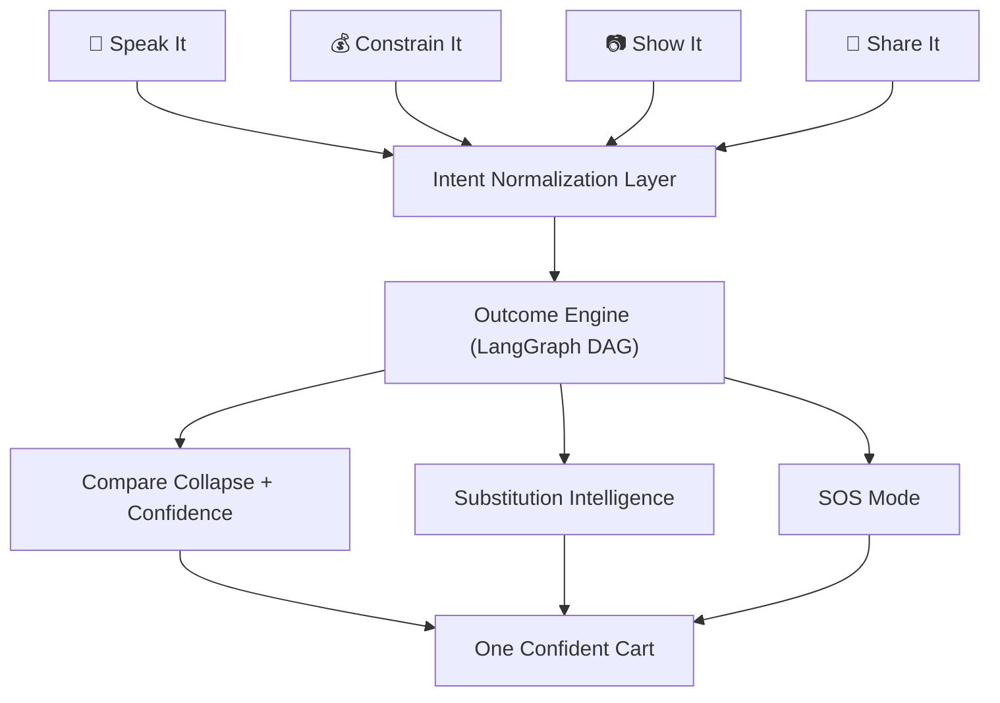

# NowCart — The Intent-Capture Layer for Quick Commerce

> *"Quick commerce solved delivery. We solve the deciding."*

NowCart removes the search box from grocery shopping. Instead of typing product names, users express a **life moment** — say it, show it, share it, or set a budget — and the AI assembles one confident cart, defends every choice, and handles out-of-stock invisibly.

**Four ways in. One brain. One confident cart out.**

**Live Application:** [https://d2hj5yrm8sue4v.cloudfront.net](https://d2hj5yrm8sue4v.cloudfront.net)

---

## The Problem

Online grocery shoppers spend **10+ minutes** assembling a cart for something they already know the *outcome* of ("I'm making Biryani for 4"). They manually search each ingredient, compare variants, check stock, substitute when unavailable, and lose confidence in their choices. This is a universal friction point affecting **300M+ online grocery users globally** — the deciding step, not the delivery step.

## Our Solution

NowCart is the missing **intelligence layer between a human need and fulfillment**. It provides multiple "front doors" for expressing intent, all routing into one Outcome Engine:

| Front Door | Input | Example |
|-----------|-------|---------|
| 🎤 **Speak It** | Voice / text | "I'm making Biryani for 4" |
| 💰 **Constrain It** | Budget + headcount | "₹500, dinner for 4 tonight" |
| 📷 **Show It** | Photo of a dish | *snap a plate of Dal Makhani* |
| 🔗 **Share It** | Recipe URL / text | YouTube recipe link or pasted ingredients |
| ⚡ **SOS Mode** | Emergency situation | "Guests arriving in 30 minutes" |

Every input produces one **confident cart** with:
- Per-item confidence scores ("87% confident")
- One-line reasoning ("picked this because: organic, best price-per-litre, you bought it before")
- Transparent out-of-stock substitutions
- HITL (human-in-the-loop) gates when confidence is low

---

## Key Features

### 1. Outcome Engine (LangGraph Multi-Agent Pipeline)
A 6-node directed acyclic graph that transforms natural language into a fully matched grocery cart:
```
Intent → Decompose → Match → Optimize → Substitute → Confidence
```
- Shared state via TypedDict (not a linear chain — later nodes access earlier state)
- Mode-aware prompting (recipe, budget, goal, SOS)
- Graceful degradation at every node

### 2. Hybrid Fuzzy Matching
- **rapidfuzz WRatio** scoring (picks best from ratio, partial_ratio, token_sort_ratio, token_set_ratio)
- **Category alias bridging** (30+ aliases map LLM hints to BigBasket taxonomy)
- **Word-presence re-ranking** with stem-based bonuses (+20/+35) and penalties (-15)
- Matches against 9,534 real Indian grocery products

### 3. Constraint-First Budget Optimization
Works **backwards** from money: run full pipeline, then greedy knapsack (sort by confidence descending, keep items until budget exhausted). Highest-confidence items always survive.

### 4. Substitution Intelligence
Out-of-stock items are swapped **functionally and transparently**:
- Checks remaining fuzzy-match candidates in score order
- Records substitution metadata (original → substitute + reason)
- Demo never breaks on stock issues

### 5. Comparison Collapse + Confidence Score
The AI doesn't dump 6 choices. It shows **one pick + a "why" + a confidence %**. The reasoning trail is a first-class UI element, not hidden debug info.

### 6. SOS / Emergency Mode
One button for genuine urgency. AI analyzes the situation, assembles an emergency kit from in-stock-only items, and shows a countdown to estimated delivery.

### 7. Multi-Provider LLM Architecture
Protocol-based abstraction with seamless swapping:
- **Groq** (Llama 3.3 70B, 200+ tok/s) — current, free tier
- **Gemini** (2.0 Flash) — vision + text, free tier
- **Bedrock** (Claude 3 Haiku) — production target, VPC-native
- **Mock** — deterministic, zero-dependency testing
- Swap: change one env var (`LLM_TEXT_PROVIDER=bedrock`)

### 8. Production-Grade Middleware
- Token-bucket rate limiting (60 req/min/IP)
- PII redaction in all logs (phone/email regex masking)
- Request-level telemetry (latency, P95, cache hit ratio)
- Unique request correlation IDs

### 9. LLM Response Caching
SHA-256(prompt) → Redis with 1-hour TTL. Identical queries (100 users asking "Biryani for 4") hit cache on requests 2-100.

---

## Tech Stack

| Layer | Technology | Why |
|-------|-----------|-----|
| Frontend | React 19 + Vite 8 + TailwindCSS 4 | Fastest build tooling, auto-generated types |
| Backend | FastAPI + Pydantic 2 (async) | Native async, auto OpenAPI, typed validation |
| AI Pipeline | LangGraph (StateGraph DAG) | Composable multi-step reasoning with state persistence |
| Text LLM | Groq (Llama 3.3 70B) | Free, fastest inference (200+ tok/sec) |
| Vision LLM | Google Gemini 2.0 Flash | Free tier, best multimodal for food recognition |
| Prod LLM | Amazon Bedrock (Claude 3 Haiku) | VPC-native, IAM auth, auto-scaling |
| Database | DynamoDB (PAY_PER_REQUEST) | 25GB free, auto-scales, GSI for categories |
| Cache | Redis 7 | Sub-ms cart ops, session state, LLM response cache |
| Matching | rapidfuzz (C-optimized) | 100x faster than difflib for fuzzy matching |
| Infra | EC2 + Nginx + S3 + CloudFront | Full stack within AWS free tier |
| Async | Lambda + SQS (designed) | Offload slow LLM calls, auto-scales to 1000 concurrent |
| Container | Docker Compose (4 services) | One-command full-stack dev environment |

---

## Architecture



See [SYSTEM_ARCHITECTURE.md](./SYSTEM_ARCHITECTURE.md) for the full deep-dive with data flow diagrams, node-by-node pipeline details, and infrastructure diagrams.

---

## Quick Start

### Prerequisites
- Python 3.11+
- Node.js 20+
- Docker & Docker Compose (optional, for full stack)

### Option 1: Docker Compose (recommended)

```bash
# Clone and start everything
git clone https://github.com/your-team/NowCart.git
cd NowCart

# Set API keys (optional — works without them using mock providers)
echo "GROQ_API_KEY=your-groq-key" > .env
echo "GEMINI_API_KEY=your-gemini-key" >> .env

# Start full stack
docker compose up --build

# Access:
#   Frontend:  http://localhost:3000
#   Backend:   http://localhost:8000
#   API docs:  http://localhost:8000/docs
```

### Option 2: Local Development

```bash
# Backend
cd server
cp .env.example .env     # edit with your API keys
uv venv && uv pip install -r requirements.txt
uv run uvicorn app.main:app --reload --port 8000

# Frontend (separate terminal)
cd client
npm install
npm run dev              # http://localhost:5173 (proxies /api to :8000)
```

### Option 3: Zero-Dependency Demo

```bash
# No API keys, no Redis, no DynamoDB needed
cd server
DATA_BACKEND=memory LLM_TEXT_PROVIDER=mock CACHE_IN_MEMORY=true \
  uv run uvicorn app.main:app --port 8000
```

---

## Environment Configuration

| Variable | Default | Description |
|----------|---------|-------------|
| `DATA_BACKEND` | `memory` | `memory` or `dynamodb` |
| `LLM_TEXT_PROVIDER` | `mock` | `groq`, `gemini`, `bedrock`, `mock` |
| `LLM_VISION_PROVIDER` | `mock` | `gemini`, `mock` |
| `GROQ_API_KEY` | — | Groq Cloud API key |
| `GEMINI_API_KEY` | — | Google AI Studio key |
| `REDIS_URL` | `redis://localhost:6379/0` | Redis connection string |
| `CACHE_IN_MEMORY` | `true` | `true` to skip Redis |
| `AWS_REGION` | `ap-south-1` | AWS region for DynamoDB/Bedrock |
| `CONFIDENCE_THRESHOLD` | `0.7` | Below this, HITL clarification triggers |
| `CORS_ORIGINS` | `http://localhost:5173,...` | Allowed CORS origins |

### Environment Modes

| Mode | `DATA_BACKEND` | `CACHE_IN_MEMORY` | `LLM_TEXT_PROVIDER` | External Deps |
|------|---------------|-------------------|---------------------|---------------|
| Zero-dep demo | `memory` | `true` | `mock` | None |
| Docker Compose | `dynamodb` | `false` | `groq` | Redis + DynamoDB Local |
| Production | `dynamodb` | `false` | `groq`/`bedrock` | AWS DynamoDB + Redis |

---

## API Reference

### Core Endpoints

| Method | Path | Description | Input |
|--------|------|-------------|-------|
| POST | `/api/outcome` | Text → cart (main engine) | `{text, servings?}` |
| POST | `/api/voice/intent` | Voice transcript → cart | `{transcript, session_id?}` |
| POST | `/api/constraint` | Budget-first cart | `{budget, servings, text?}` |
| POST | `/api/vision/analyze` | Photo → cart (multipart) | `file + text? + session_id?` |
| POST | `/api/share/parse` | URL/text → cart | `{url?, text?, session_id?}` |
| POST | `/api/sos` | Emergency kit → cart | `{situation}` |
| POST | `/api/sos/recommend` | Emergency recommendations | `{situation}` |

### Cart Operations

| Method | Path | Description | Input |
|--------|------|-------------|-------|
| POST | `/api/cart/op` | Add/remove/update item | `{session_id, op, entity, quantity?}` |
| GET | `/api/cart/{session_id}` | Get cart state | — |

### Catalog & Search

| Method | Path | Description | Params |
|--------|------|-------------|--------|
| GET | `/api/catalog/search` | Product search | `?q=&category=&limit=` |
| GET | `/api/catalog/recommend` | Best + alternatives | `?q=&limit=` |

### Observability

| Method | Path | Description |
|--------|------|-------------|
| GET | `/api/meta/stats` | Real-time metrics (latency, errors, cache) |
| GET | `/api/meta/info` | System config (providers, backends) |
| GET | `/health` | Liveness probe |

---

## Project Structure

```
NowCart/
├── client/                     # React 19 frontend
│   ├── src/
│   │   ├── api/               # Typed API client + OpenAPI types
│   │   ├── pages/             # 5 route-level pages
│   │   ├── components/        # UI components
│   │   │   ├── frontdoors/    # 4 front door panels
│   │   │   └── cart/          # WhyThisOne, HitlPrompt, EngineTrail
│   │   └── ui/                # Design system primitives
│   ├── Dockerfile             # Multi-stage build
│   └── nginx.conf             # SPA routing + API proxy
│
├── server/                     # FastAPI backend
│   ├── app/
│   │   ├── agents/            # LangGraph pipeline (graph + 6 nodes)
│   │   ├── controllers/       # 11 HTTP routers
│   │   ├── services/          # Business logic (7 services)
│   │   ├── llm/               # Provider abstraction (4 providers)
│   │   ├── repositories/      # Data access (memory + DynamoDB)
│   │   ├── middleware/        # Rate limit, telemetry, PII, request ID
│   │   ├── async_jobs/        # Lambda handlers + SQS publisher
│   │   ├── models/            # Domain + DTO models
│   │   └── seed/              # Catalog seeding (9,534 products)
│   └── Dockerfile
│
├── docker-compose.yml          # 4-service full stack
├── SYSTEM_ARCHITECTURE.md      # Deep technical architecture doc
└── NowCart_9534.csv            # Real Indian grocery product catalog
```

---

## Future Vision

| Horizon | Milestone | Impact |
|---------|-----------|--------|
| 0–3 mo | Food/grocery outcome ordering in one city | 10K users, prove the thesis |
| 3–6 mo | Pharmacy + emergency kits, multi-language voice | 100K users, SOS saves lives |
| 6–12 mo | B2B restocking (restaurants, offices), travel/event kits | 1M users, horizontal platform |

**The big picture:** NowCart becomes the universal **"need → done"** layer on top of any fulfillment network.

---

## Team

| Name | Role | Contribution |
|------|------|-------------|
| [Member 1] | Backend + AI | LangGraph pipeline, LLM providers, services |
| [Member 2] | Frontend | React app, front door panels, cart UX |
| [Member 3] | Infrastructure | AWS deployment, Docker, DynamoDB, Redis |
| [Member 4] | Product + Design | UX flow, presentation, demo script |

---
