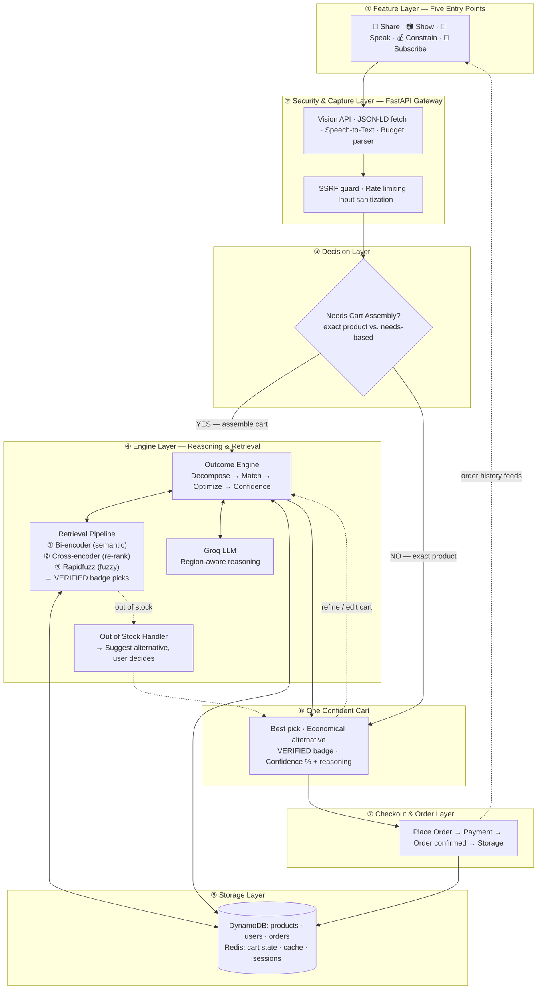

# NowCart

**Quick commerce solved delivery. We solve the deciding.**

NowCart is an AI-powered cart-assembly engine for quick commerce. Instead of searching item by item, you express a need — a photo, a recipe link, a voice note, a budget, or a recurring schedule — and the engine builds a checkout-ready cart in seconds.

> Built for HackOn with Amazon · Theme: Amazon Now — Reimagining Urgent Shopping  
> Team Codyssey · 48-hour hackathon · 15 June 2026

---

## Live Demo

| | |
|---|---|
| **Live App** | https://d2hj5yrm8sue4v.cloudfront.net |
| **Demo user** | `rahul@gmail.com` — any password (full order history, predictions, subscriptions) |
| **Admin** | `admin@nowcart.app` — any password |

---

## The Problem

<cite index="1-5">290–300M online shoppers in India spend 5–7 minutes per order searching items, comparing variants, and finding substitutes when something is out of stock.</cite> <cite index="1-6,1-7">Delivery takes 10 minutes; the decision takes just as long — and no platform solves it. Every app still forces you to pick items one by one.</cite>

<cite index="1-11">This "deciding time" sits on top of a $7B+ quick-commerce market in India that perfected 10-minute delivery but left cart-building completely unsolved.</cite> <cite index="1-12">~70% of online carts are abandoned before checkout — 7 of 10 carts where the user gave up.</cite>

---

## Five Front Doors, One Engine

<cite index="1-21,1-22,1-23">Every platform works product → requirement. NowCart reverses it: requirement → product. Tell us what to make, we assemble what to buy — "penne pasta for 2" builds the cart.</cite>

| Front Door | You do | NowCart does |
|---|---|---|
| **Show** | Snap a dish photo | Gemini 2.0 Flash runs vision inference, extracts every ingredient, maps each to the catalog |
| **Share** | Paste a recipe link or YouTube URL | httpx fetches the URL, LLM extracts the ingredient list, outcome engine builds the cart |
| **Speak** | Say "biryani for 4" | LLM decomposes intent · bi-encoder + cross-encoder + rapidfuzz assembles a confidence-scored cart |
| **Constrain** | Set a budget (e.g. ₹1000 dinner for 2) | Full pipeline runs, then a greedy confidence-sorted knapsack trims items until total fits budget |
| **Subscribe** | Set recurring items or do nothing | Computes inter-purchase intervals from order history, scores regularity via coefficient of variation, pre-builds a restock cart before you ask |

### What makes it different

<cite index="1-24,1-25,1-26,1-27">Core novelty — Informed Choice, not Forced Choice — rank by relevance and surface the highest-confidence picks with a NowCart Verified badge (most ordered + highest rated). User still picks, with clarity not chaos. No brand bias, no hidden AI selection. Every cart also ships a parallel Economical view — the cheapest in-stock alternative per item with the exact saving shown — giving users a financial reason to complete checkout rather than abandon.</cite>

---

## Architecture

```
Five Entry Points → Security & Capture → Decision → Engine (Planning & Retrieval) → Storage → Checkout → Customer
```



### Key Algorithms

<cite index="1-70,1-71,1-72">**LangGraph Multi-Agent Pipeline** — 10-node reasoning graph, shared typed state, self-correcting replan loop (capped at 2 passes). Composable and debuggable, not one brittle mega-prompt. O(needs × catalog).</cite>

<cite index="1-73,1-74">**Hybrid Retrieval (Bi + Cross + Fuzzy)** — bi-encoder (all-MiniLM-L6-v2, 80MB) → top-20 by meaning; cross-encoder (ms-marco-MiniLM-L-6-v2, 80MB) re-ranks; rapidfuzz for typos. Catches "cottage cheese→paneer", "malai→cream", "tomatoe→tomato".</cite>

<cite index="1-76,1-77">**Confidence-Sorted Budget Fill** — items ranked by confidence, kept greedily until budget runs out, so the most trustworthy picks survive. One sort + one pass.</cite>

<cite index="1-78,1-79,1-80">**Subscribe (Predictive Restock)** — measures inter-purchase intervals, projects depletion via coefficient-of-variation scoring, ranks certainty by pattern regularity — pure statistics, no training, no cold start. Recurring schedules resolve per-product at cart-load. O(products × history); O(1) lookup.</cite>

<cite index="1-81">**LLM Response Caching** — each prompt hashed to a 1-hour Redis entry — 100 identical queries cost 1 model call + 99 sub-ms hits, cutting spend and ~800 ms latency per repeat.</cite>

---

## Tech Stack

| Layer | Technology |
|---|---|
| **Frontend** | React 19 + Vite + TailwindCSS 4 · PWA (installable, offline shell, service worker) |
| **Backend** | FastAPI + Pydantic 2 (fully async) · Python 3.12 |
| **AI / ML** | LangGraph · Groq (Llama 3.3 70B) · Gemini 2.0 Flash · Bedrock (Claude 3 Haiku) · pure-NumPy TF-IDF · rapidfuzz |
| **Database** | DynamoDB (PAY_PER_REQUEST) |
| **Cache** | Redis — cart state, sessions, LLM response cache (1-hour TTL) |
| **Infra** | EC2 + Nginx · S3 + CloudFront · AWS ap-south-1 |
| **CI/CD** | GitHub Actions — push to `master` → build frontend → sync S3 → invalidate CloudFront → SSH deploy backend to EC2 |
| **Mobile** | Capacitor (Android APK build supported) |

---

## CI/CD Pipeline

Every push to `master` triggers a two-job GitHub Actions workflow:

```
push to master
    │
    ├── Job 1: Build & Deploy Frontend
    │     ├── npm ci + npm run build (tsc + vite)
    │     ├── aws s3 sync dist/ → s3://nowcart-frontend-strizzy --delete
    │     └── CloudFront invalidation (distribution E12DWQGXBDIMR3)
    │
    └── Job 2: Deploy Backend to EC2  (runs after Job 1)
          ├── SSH into EC2
          ├── git pull origin master
          └── sudo systemctl restart nowcart
```

No manual steps. The workflow file is at `.github/workflows/deploy.yml`.

Required GitHub secrets: `AWS_ACCESS_KEY_ID`, `AWS_SECRET_ACCESS_KEY`, `EC2_HOST`, `EC2_USER`, `EC2_SSH_KEY`.

---

## Project Structure

```
NowCart/
├── client/                     # React 19 + Vite PWA
│   ├── src/
│   │   ├── api/                # Typed API client (client.ts)
│   │   ├── components/
│   │   │   ├── cart/           # CartDrawer, ReplanBar, WhyThisOne, EngineTrail
│   │   │   ├── frontdoors/
│   │   │   │   └── panels/     # SpeakPanel, ShowPanel, SharePanel, ConstrainPanel, SubscribePanel
│   │   │   └── Header, Footer, PwaInstallPrompt, ...
│   │   ├── context/            # AppContext, LocationContext
│   │   ├── hooks/              # usePwaInstall, useLocation
│   │   └── pages/              # LoginPage, HomePage, AdminDashboardPage, OrderHistoryPage, ...
│   └── vite.config.ts          # PWA manifest + workbox config
│
├── server/                     # FastAPI backend
│   ├── app/
│   │   ├── agents/             # LangGraph nodes + outcome graph
│   │   ├── controllers/        # API route handlers (voice, vision, share, subscribe, ...)
│   │   ├── core/               # Config, logging, middleware
│   │   ├── models/             # Pydantic DTOs
│   │   ├── repositories/       # DynamoDB + memory backends
│   │   ├── services/           # catalog, outcome, subscribe, semantic_search
│   │   └── seed/               # Catalog loader + mock data
│   └── requirements.txt
│
├── .github/
│   └── workflows/
│       └── deploy.yml          # CI/CD: frontend → S3/CloudFront, backend → EC2
│
└── BigBasket.csv               # Source catalog (~9,534 products)
```

---

## Running Locally

### Backend

```bash
cd server
python -m venv .venv
.venv\Scripts\activate          # Windows
pip install -r requirements.txt

# Minimal config — runs fully in-memory with mock LLM (no API keys needed)
cp .env.example .env            # or create .env with DATA_BACKEND=memory

uvicorn app.main:app --reload --port 8000
```

Key `.env` variables:

| Variable | Default | Description |
|---|---|---|
| `LLM_TEXT_PROVIDER` | `mock` | `groq` / `gemini` / `bedrock` / `mock` |
| `LLM_VISION_PROVIDER` | `mock` | `gemini` / `mock` |
| `DATA_BACKEND` | `memory` | `memory` (no AWS needed) or `dynamodb` |
| `GROQ_API_KEY` | — | Required when `LLM_TEXT_PROVIDER=groq` |
| `GEMINI_API_KEY` | — | Required when `LLM_VISION_PROVIDER=gemini` |
| `REDIS_URL` | `redis://localhost:6379/0` | Falls back to in-memory cache if Redis unavailable |
| `SEMANTIC_SEARCH_ENABLED` | `true` | Downloads 80MB models on first run |

### Frontend

```bash
cd client
npm install
npm run dev       # starts at http://localhost:5173, proxies /api → :8000
```

### Build for production

```bash
cd client
npm run build     # tsc + vite → dist/
```

---

## PWA — Install on Mobile

NowCart is a full Progressive Web App:

- **Chrome/Android** — tap the Install button in the app header, or use Chrome's "Add to Home Screen"
- **iOS/Safari** — tap Share → Add to Home Screen
- Offline shell cached via Workbox service worker
- Manifest declares `microphone` and `geolocation` permissions so Android surfaces them in App Info → Permissions

---

## Admin Dashboard

Log in as `admin@nowcart.app` (any password) to see:

- **Overview** — total requests, AI-assembled carts built, avg latency, error rate, LLM cache hit ratio
- **Infra & Cost tab** — AI providers (Groq / Gemini), infrastructure (DynamoDB, Redis, AWS ap-south-1), AWS billing ($0.00 — fully on free tier)

---

## Catalog

9,534 products sourced from BigBasket (`BigBasket.csv`), spanning Fruits & Vegetables, Staples, Dairy, Snacks, Beverages, Personal Care, and more. Loaded into memory (or DynamoDB) on startup. The NowCart Verified badge marks the highest-rated, most-ordered product in each category.

---

## Team

<cite index="1-3">**Rohan Singh** — RGIPT, Bangalore · Backend + Deployment  
**Anuj Kumar Yadav** — NSUT, Delhi · Frontend + Backend  
**Baibhav Kundu** — NSUT, Delhi · Machine Learning</cite>

---

## Scaling Strategy

<cite index="1-82,1-83,1-84">**Stateless API** — cart state lives in Redis, not the server process, so any instance serves any request. 100×: Auto Scaling Group behind a load balancer. 1000×: multi-region groups + latency-based routing.</cite>

<cite index="1-87">**LLM offloading** — inefficient AI calls (vision ~3s, recipe ~2s) move to Lambda via SQS, auto-scaling to 1000 parallel executions — decoupling API response time from AI processing entirely.</cite>

<cite index="1-91">**Provider abstraction** — Groq → any upcoming model is a single env var; at scale Bedrock runs in-network with managed throughput and no third-party rate limits.</cite>
