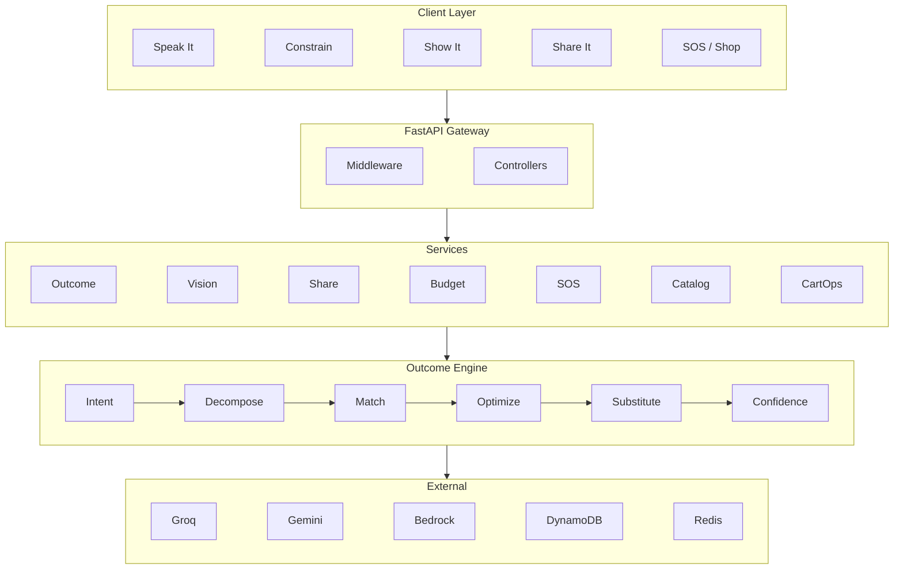
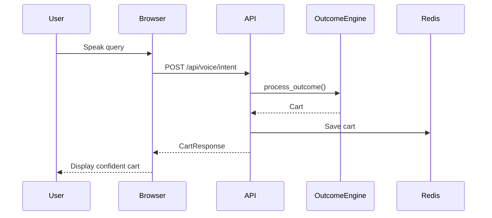
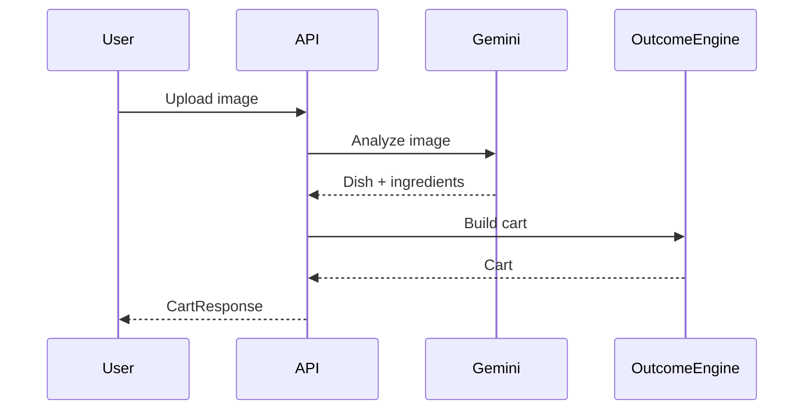
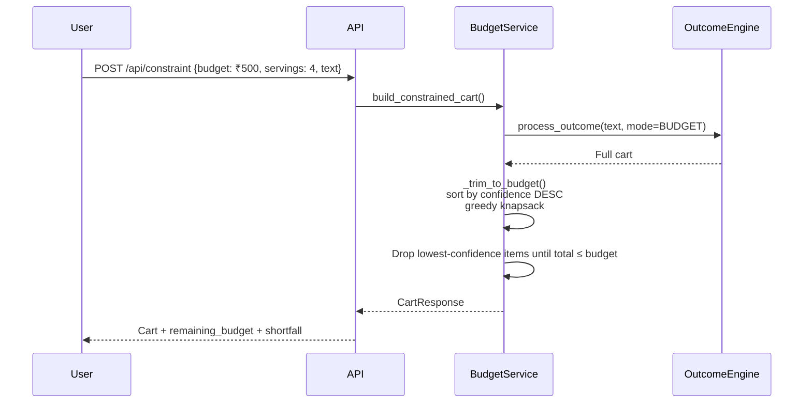
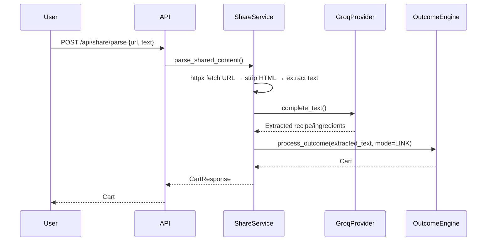
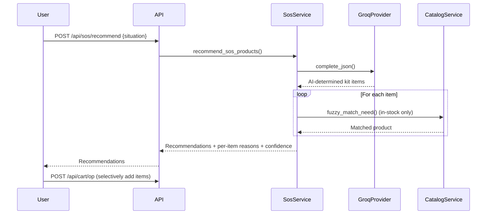
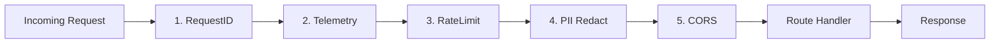
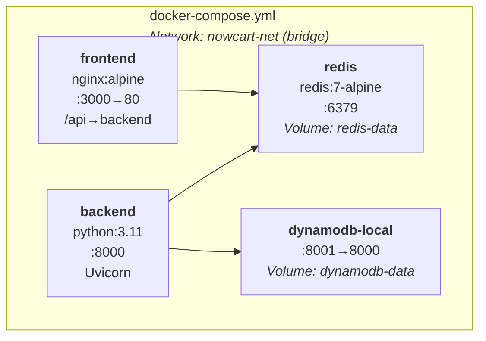
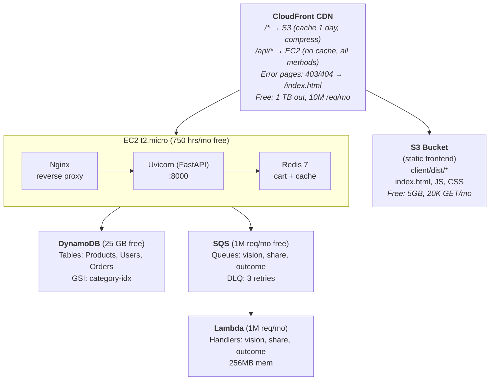
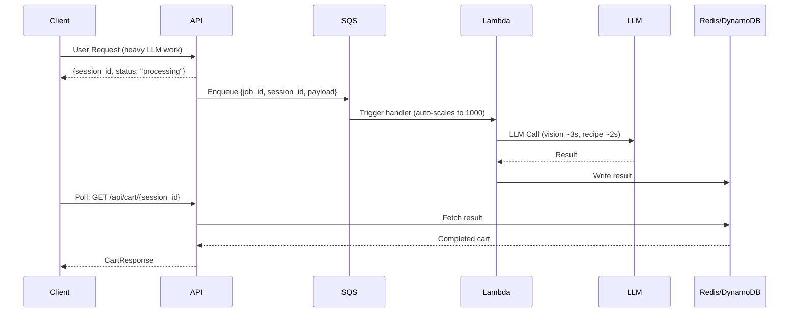

# NowCart — System Architecture Document

## Executive Summary

NowCart is an **intent-capture layer** for quick commerce that transforms natural-language user needs into ready-to-checkout grocery carts. The core thesis: *"Quick commerce solved delivery. We solve the deciding."*

The system exposes **four front doors** (Speak, Constrain, Show, Share) that feed into a single **LangGraph multi-agent pipeline** (the Outcome Engine), which decomposes intent, matches against a 9,500+ product catalog via hybrid fuzzy matching, applies budget optimization, handles out-of-stock substitution transparently, and outputs **one confident cart** with per-item confidence scores and reasoning trails.

---

## High-Level Architecture Diagram



---

## Outcome Engine — Node-by-Node Detail

### 1. Intent Node
- **Input:** `raw_input` (string)
- **Logic:** Regex-based keyword matching against 8 intent modes (RECIPE, BUDGET, SOS, CART_OP, PHOTO, LINK, GOAL, TEXT). Extracts serving count via regex (`for N people/servings`).
- **Output:** `{mode: IntentMode, servings: int, reasoning_trail[]}`
- **Complexity:** O(K) where K = number of keyword patterns (constant, ~40)

### 2. Decompose Node
- **Input:** `raw_input`, `mode`, `servings`
- **Logic:** Calls LLM with mode-specific system prompts:
  - RECIPE mode: "Decompose into shopping list of ingredients for N people"
  - BUDGET mode: "Suggest a complete Indian meal within budget constraints"
  - GOAL mode: "Recommend grocery products for this wellness goal"
- **Output:** `{needs: Need[], reasoning_trail[]}`
- **LLM:** Groq Llama 3.3 70B (JSON mode, 0.2 temperature)
- **Caching:** SHA-256(system+user) → Redis, 1hr TTL. Identical prompts return instantly.

### 3. Match Node
- **Input:** `needs[]`
- **Logic:** For each need, calls `CatalogService.fuzzy_match_need()`:
  1. Category filtering via `_CATEGORY_ALIASES` map (30+ aliases → BigBasket taxonomy)
  2. rapidfuzz `WRatio` scoring (internally picks best from ratio, partial_ratio, token_sort_ratio, token_set_ratio)
  3. Custom re-ranking: stem-based word-presence scoring with +20/+35 bonuses and -15 penalties
  4. Returns top-5 candidates per need
- **Output:** `{candidates: {need_name → [(product_id, name, score, price, image_url)]}, needs[] updated}`
- **Complexity:** O(N × M) where N = needs count, M = category-filtered catalog size; inner fuzzy = O(K log K) per need

### 4. Optimize Node
- **Input:** `needs[]`, `candidates{}`
- **Logic:**
  1. For each need, picks highest-scoring in-stock candidate
  2. Applies quantity normalization: raw LLM quantities (500g, 200ml, 2 tbsp) → "number of packs to buy" via `_normalize_quantity_to_packs()`
  3. Handles weight units, volume units, spoon measures, pack units
- **Output:** `{cart: Cart with CartItems[], notes[]}`
- **Complexity:** O(N × C) where C = candidates per need (≤5)

### 5. Substitute Node
- **Input:** `cart`, `candidates{}`
- **Logic:** For items where the primary pick is out-of-stock:
  1. Checks remaining candidates in score order
  2. Picks first available substitute
  3. Records substitution metadata (original → substitute, reason)
- **Output:** `{cart: Cart with substitutions applied, substitutions[]}`
- **Complexity:** O(I × C) where I = OOS items, C = candidates

### 6. Confidence Node
- **Input:** `cart`
- **Logic:**
  1. Computes per-item confidence from fuzzy match score (score/100, capped at 1.0)
  2. Computes aggregate cart confidence (weighted average)
  3. If confidence < threshold (0.7): generates a HITL clarification question
- **Output:** `{confidence: float, clarification: str | None}`

---

## Data Flow Diagrams

### Speak It — Voice-to-Cart


### Show It — Photo-to-Cart


### Constrain It — Budget-First Cart


### Share It — Link/Text-to-Cart


### SOS Mode — Emergency Kit


---

## Middleware Stack (execution order)



**Middleware details:**
| # | Middleware | Responsibility |
|---|-----------|---------------|
| 1 | RequestIdMiddleware | UUID correlation ID (X-Request-ID header) |
| 2 | TelemetryMiddleware | Timer, path/status/latency tracking, P95 calc |
| 3 | RateLimitMiddleware | Token-bucket: 60 req/min per IP, 429 on exhaust |
| 4 | PiiRedactionMiddleware | Regex mask phone/email in logs (not in data) |
| 5 | CORSMiddleware | Allow configured origins, all methods/headers |

---

## LLM Provider Architecture

### Protocol-Based Abstraction
```python
class LLMProvider(Protocol):
    name: str
    async def complete_json(system, user, schema_hint) -> dict
    async def complete_text(system, user) -> str

class VisionProvider(Protocol):
    name: str
    async def describe_image(image_bytes, prompt) -> dict
```

### Provider Registry (Factory Pattern)
| Provider | Model | Use Case | Swap Mechanism |
|----------|-------|----------|----------------|
| `GroqProvider` | Llama 3.3 70B (200+ tok/s) | Text reasoning (free tier) | `LLM_TEXT_PROVIDER=groq` |
| `GeminiProvider` | Gemini 2.0 Flash | Text + Vision (free tier) | `LLM_VISION_PROVIDER=gemini` |
| `BedrockProvider` | Claude 3 Haiku | Production target (VPC-native) | `LLM_TEXT_PROVIDER=bedrock` |
| `MockProvider` | Deterministic rules | Zero-dep testing | `LLM_TEXT_PROVIDER=mock` |

### LLM Response Caching
- **Key:** SHA-256(system_prompt + user_input)[:32]
- **Storage:** Redis (or memory fallback)
- **TTL:** 3,600 seconds (1 hour)
- **Impact:** Same recipe query served in <1ms instead of ~800ms LLM call
- **Savings:** At 100 users asking for "Biryani for 4", 99 API calls saved

---

## Catalog Matching Algorithm (Deep Dive)

### Three-Phase Strategy

**Phase 1: Category Filtering**
```
LLM category_hint (e.g. "grains") 
  → _CATEGORY_ALIASES lookup → ["foodgrains oil masala", "rice", "dals pulses"]
  → Filter 9,534 products to ~200-800 candidates
```

**Phase 2: Fuzzy Scoring (rapidfuzz WRatio)**
```
For each candidate in filtered set:
  score = fuzz.WRatio(need_name, product_name)
  
WRatio internally picks BEST from:
  - fuzz.ratio (simple Levenshtein)
  - fuzz.partial_ratio (substring matching)
  - fuzz.token_sort_ratio (word-order agnostic)
  - fuzz.token_set_ratio (handles extra words)
```

**Phase 3: Word-Presence Re-ranking**
```
For top candidates:
  - +20 bonus if all query words appear in product name
  - +35 bonus for exact phrase match
  - -15 penalty for false positives (matched a substring of unrelated word)
  - Stem-based comparison for morphological variants
```

### Quantity Normalization Logic
| Input | Unit | Output (packs) | Reasoning |
|-------|------|----------------|-----------|
| 500 | grams | 1 | Under 1kg = 1 pack |
| 2 | kg | 2 | Direct kg mapping |
| 200 | ml | 1 | Under 1L = 1 pack |
| 2 | tablespoons | 1 | Spoon measure = buy 1 jar |
| 6 | pieces | 6 | Direct piece count |
| 2 | medium | 2 | Adjective unit = count |

---

## Infrastructure Architecture

### Development (Docker Compose)


### Production (AWS Free Tier)


### Async Job Flow (Lambda + SQS)


---

## Security & Production Hardening

| Layer | Implementation |
|-------|---------------|
| **Rate Limiting** | Token-bucket: 60 req/min/IP, X-RateLimit-* headers, 429 response |
| **PII Redaction** | Regex masking (phone/email) in all request body logs |
| **Request Correlation** | UUID X-Request-ID on every request/response |
| **CORS** | Configurable origin whitelist via env var |
| **IAM (prod)** | EC2 instance profile → DynamoDB/SQS/Lambda (no API keys) |
| **Graceful Degradation** | Every provider falls back to mock; pipeline never crashes |
| **Input Validation** | Pydantic v2 models on all request DTOs |
| **Error Envelope** | Consistent `{error, detail}` JSON on all 4xx/5xx |

---

## Observability & Telemetry

### Metrics Endpoint: `GET /api/meta/stats`
```json
{
  "total_requests": 847,
  "total_errors": 3,
  "error_rate": 0.0035,
  "avg_latency_ms": 245.3,
  "p95_latency_ms": 1200.5,
  "carts_built": 124,
  "cache_hits": 67,
  "cache_misses": 57,
  "top_paths": {"/api/outcome": 89, "/api/catalog/search": 234},
  "status_codes": {"200": 820, "429": 24, "500": 3}
}
```

### System Info: `GET /api/meta/info`
```json
{
  "providers": {"text_llm": "groq", "vision_llm": "gemini"},
  "backends": {"data": "dynamodb", "cache": "redis"},
  "features": {"rate_limiting": true, "llm_response_caching": true},
  "scaling": {"architecture": "stateless API + Redis + DynamoDB"}
}
```

---

## Tech Stack Summary

| Layer | Technology | Justification |
|-------|-----------|---------------|
| Frontend | React 19 + Vite 8 + TailwindCSS 4 | Fastest build tooling, type-safe OpenAPI types |
| Routing | React Router v7 | SPA with clean URL structure |
| Icons | Lucide React | Tree-shakeable, consistent icon set |
| Backend | FastAPI + Pydantic 2 (async) | Native async, auto OpenAPI schema, typed validation |
| AI Pipeline | LangGraph (StateGraph DAG) | Composable multi-step reasoning with shared state |
| Text LLM | Groq (Llama 3.3 70B) | Free, 200+ tokens/sec, open-weight |
| Vision LLM | Google Gemini 2.0 Flash | Free tier, best multimodal quality for food |
| Prod LLM | Amazon Bedrock (Claude 3 Haiku) | VPC-native, IAM auth, auto-scaling |
| Database | DynamoDB (PAY_PER_REQUEST) | 25GB free, auto-scales, GSI for categories |
| Cache | Redis 7 | Sub-ms cart ops, session state, LLM response cache |
| Matching | rapidfuzz (C-optimized) | 100x faster than difflib for fuzzy matching |
| HTTP Client | httpx (async) | URL fetching for share service |
| Infra | EC2 + Nginx + S3 + CloudFront | Full stack within AWS free tier |
| Async | Lambda + SQS (designed) | Offload slow LLM calls, 1M free requests/month |
| Containerization | Docker Compose (4 services) | One-command local dev environment |

---

## Scaling Strategy

### Current State (Prototype)
- Single EC2 t2.micro: Uvicorn + Redis + Nginx
- DynamoDB on-demand (25GB free)
- Synchronous LLM calls in API process

### 100x Scale Path

| Layer | Current | Scaled |
|-------|---------|--------|
| Compute | 1 × EC2 t2.micro | Auto Scaling Group + ALB |
| State | Redis on same box | ElastiCache Redis cluster |
| DB | DynamoDB on-demand | DynamoDB auto-scales (built-in) |
| LLM | Sync Groq calls | Lambda + SQS async (already designed) |
| Frontend | S3 + CloudFront | Already globally distributed |
| Caching | Redis cart + LLM cache | Add DynamoDB DAX + edge caching |

### Key Architectural Decisions Enabling Scale
1. **Stateless API** — Cart lives in Redis, any instance serves any request
2. **DynamoDB on-demand** — Auto-scales without capacity planning
3. **Async offloading** — Vision/share/heavy LLM → Lambda (designed, ready to deploy)
4. **Provider abstraction** — Groq → Bedrock swap is one env var change
5. **In-memory catalog cache** — Avoids repeated DynamoDB scans per request

### 1000x / Global Scale
- CloudFront edge functions for API routing
- Multi-region DynamoDB Global Tables
- Regional EC2 behind Route 53 latency-based routing
- SQS FIFO for order-critical paths
- DynamoDB Streams → Lambda for real-time inventory sync

---

## File Structure Overview

```
NowCart/
├── client/                          # React 19 + Vite 8 frontend
│   ├── src/
│   │   ├── api/client.ts           # Typed API client (fetch-based)
│   │   ├── api/schema.d.ts         # Auto-generated OpenAPI types
│   │   ├── App.tsx                 # Router + global state (AppContext)
│   │   ├── pages/                  # Route-level components
│   │   │   ├── HomePage.tsx        # Front door hub + picks rail
│   │   │   ├── ShopPage.tsx        # Category browse + pagination
│   │   │   ├── SearchResultsPage   # Product recommendations (best + alts)
│   │   │   ├── ProductPage.tsx     # PDP with related products
│   │   │   └── SosPage.tsx         # Emergency mode UI
│   │   ├── components/
│   │   │   ├── frontdoors/         # 4 front door panels
│   │   │   │   ├── SpeakPanel.tsx  # Web Speech API + voice follow-ups
│   │   │   │   ├── ConstrainPanel  # Budget + servings form
│   │   │   │   ├── ShowPanel.tsx   # Camera/upload + vision
│   │   │   │   └── SharePanel.tsx  # URL/text paste
│   │   │   ├── CartDrawer.tsx      # Confident cart (HITL, substitutions)
│   │   │   ├── Composer.tsx        # Multi-mode search bar
│   │   │   └── cart/               # WhyThisOne, HitlPrompt, EngineTrail
│   │   └── ui/                     # Design system primitives
│   ├── Dockerfile                  # Multi-stage (node build → nginx serve)
│   └── nginx.conf                  # SPA routing + /api proxy
│
├── server/                          # FastAPI + LangGraph backend
│   ├── app/
│   │   ├── main.py                 # App factory, lifespan, middleware wiring
│   │   ├── core/config.py          # Pydantic Settings (all config)
│   │   ├── controllers/            # Thin HTTP handlers (11 routers)
│   │   ├── services/               # Business logic layer
│   │   │   ├── outcome_service.py  # Orchestrates LangGraph pipeline
│   │   │   ├── vision_service.py   # Image → cart via Gemini
│   │   │   ├── share_service.py    # URL/text → cart
│   │   │   ├── budget_service.py   # Constraint-first trim
│   │   │   ├── sos_service.py      # AI emergency kits
│   │   │   ├── catalog_service.py  # Fuzzy match + category filter
│   │   │   └── cart_ops_service.py # CRUD on existing carts
│   │   ├── agents/                 # LangGraph Outcome Engine
│   │   │   ├── graph.py            # StateGraph wiring (6 nodes → END)
│   │   │   ├── nodes.py            # Node implementations (327 lines)
│   │   │   └── state.py            # AgentState TypedDict
│   │   ├── llm/                    # Provider abstraction
│   │   │   ├── base.py             # Protocol definitions
│   │   │   ├── factory.py          # Provider factory (lru_cache)
│   │   │   ├── groq_provider.py    # Groq + caching + retry
│   │   │   ├── gemini_provider.py  # Gemini text + vision
│   │   │   ├── bedrock_provider.py # AWS Bedrock (prod target)
│   │   │   └── mock_provider.py    # Deterministic fallback
│   │   ├── repositories/           # Data access abstraction
│   │   │   ├── base.py             # Repository Protocol
│   │   │   ├── memory.py           # In-memory (zero-dep)
│   │   │   ├── dynamodb.py         # AWS DynamoDB
│   │   │   └── cache.py            # Redis + memory fallback
│   │   ├── middleware/             # Cross-cutting concerns
│   │   │   ├── request_id.py       # X-Request-ID correlation
│   │   │   ├── telemetry.py        # Timing, metrics, P95
│   │   │   ├── rate_limit.py       # Token-bucket (60/min)
│   │   │   └── pii_redaction.py    # Phone/email masking
│   │   ├── async_jobs/             # Lambda + SQS (designed)
│   │   │   ├── lambda_handlers.py  # 3 Lambda handler stubs
│   │   │   └── sqs_publisher.py    # Job queue publishing
│   │   ├── models/                 # Domain + DTO models
│   │   └── seed/                   # Catalog seeding (CSV → DB)
│   └── Dockerfile                  # Python 3.11 + uv
│
├── docker-compose.yml              # 4-service stack
├── DEPLOYMENT.md                   # Full AWS deployment guide
├── NowCart_9534.csv                # Product catalog (9,534 items)
└── scripts/                        # Data preparation utilities
```
