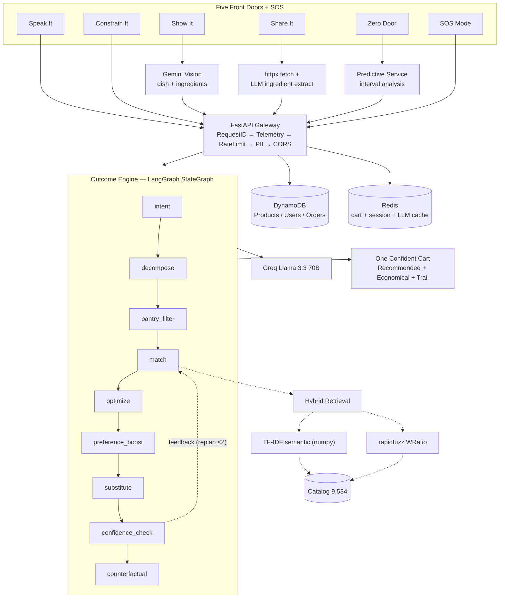
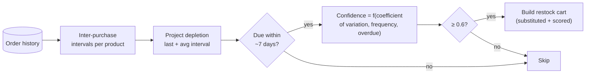
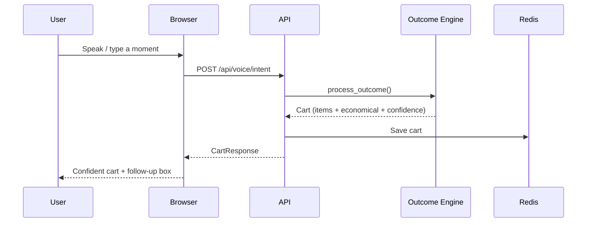
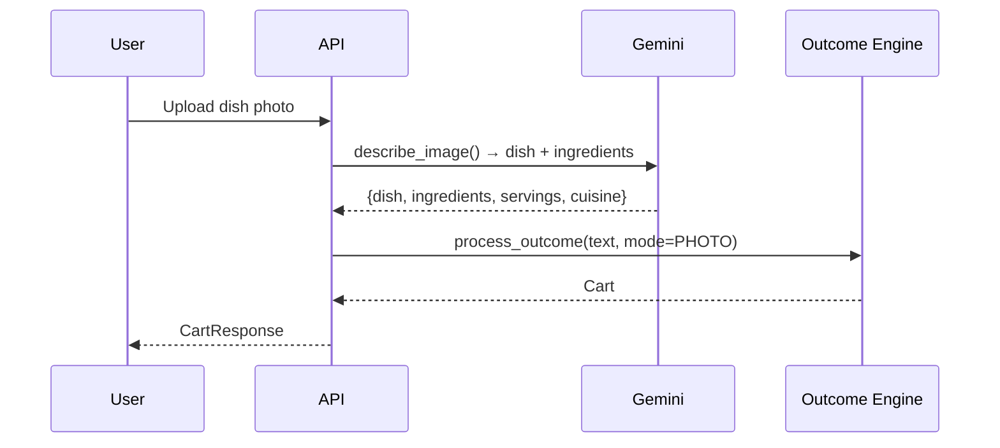
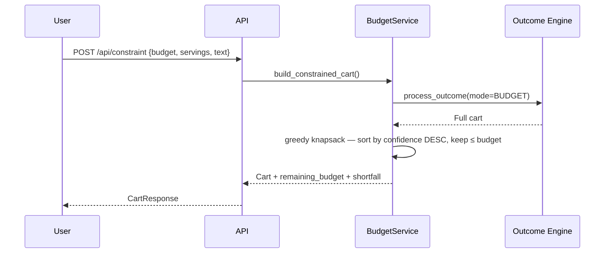
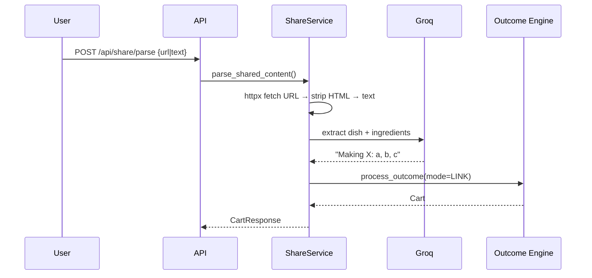
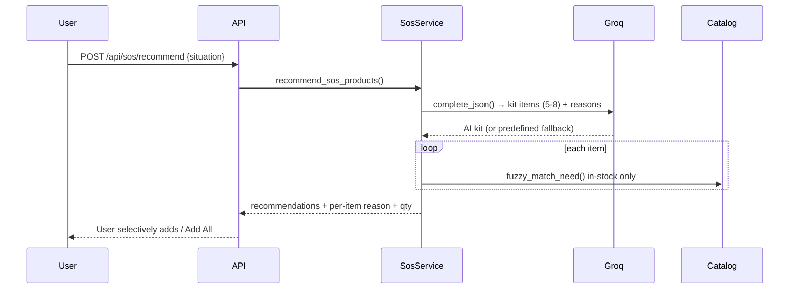
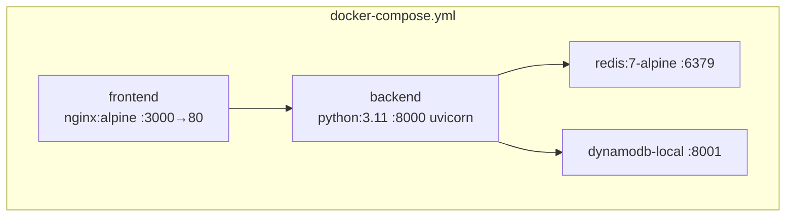
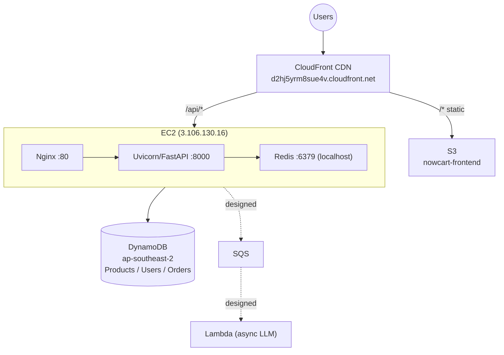
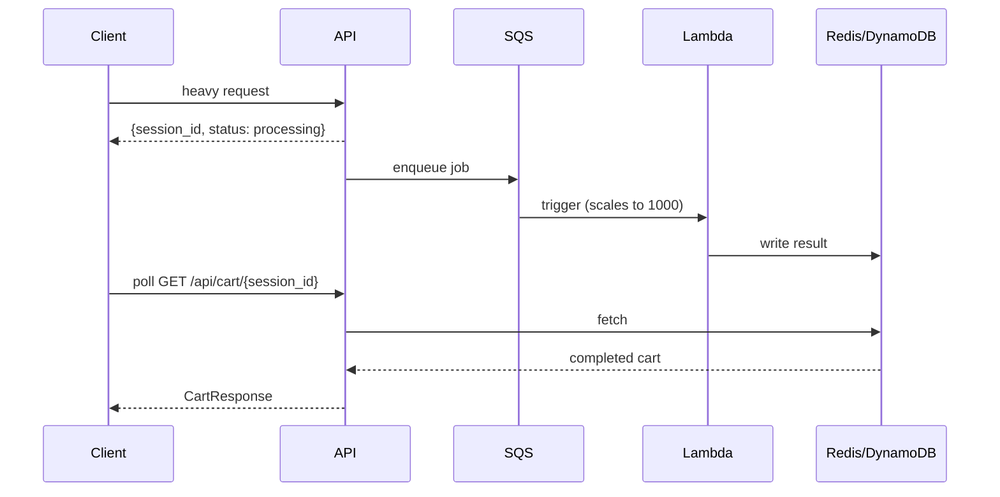

# NowCart — System Architecture Document

## Executive Summary

NowCart is an **intent-capture layer** for quick commerce that transforms natural-language user needs into ready-to-checkout grocery carts. The core thesis: *"Quick commerce solved delivery. We solve the deciding."*

The system exposes **five front doors** (Speak, Constrain, Show, Share, Zero Door) plus an SOS emergency mode, all feeding into a single **LangGraph multi-agent pipeline** (the Outcome Engine). The engine decomposes intent, filters pantry items the user already owns, matches against a **9,534-product** catalog via **hybrid retrieval** (TF-IDF semantic + rapidfuzz), personalizes from purchase history, applies budget optimization, handles out-of-stock substitution transparently, and outputs **one confident cart** with per-item confidence scores, an economical alternative view, and a full reasoning trail. A conditional re-planning loop lets users refine the cart conversationally.

---

## High-Level Architecture



---

## Outcome Engine — Node-by-Node Detail

The pipeline is a 10-node `StateGraph` with a conditional re-planning edge:

```
intent → decompose → pantry_filter → match → optimize → preference_boost
  → substitute → confidence_check → [_should_replan?]
        ├── replan → match  (loop, max 2 iterations)
        └── counterfactual → END
```

### 1. Intent Node
- **Logic:** Regex keyword matching across 8 modes (RECIPE, BUDGET, SOS, CART_OP, PHOTO, LINK, GOAL, TEXT). Extracts serving count via regex (`for N people/servings`). Respects a pre-set mode if the caller already classified it.
- **Complexity:** O(K), K ≈ 40 keyword patterns.

### 2. Decompose Node
- **Logic:** Calls the text LLM with **mode-specific system prompts** (recipe → ingredient list for N people; budget → complete Indian meal; goal → wellness shopping list). Injects re-planning constraints (dietary, max price, swaps) when present. Returns structured `Need[]` as JSON.
- **LLM:** Groq Llama 3.3 70B (JSON mode). Cached by `SHA-256(system+user)` → Redis, 1h TTL.

### 3. Pantry Filter Node
- **Logic:** If a user context exists, subtracts needs the user likely already has. Uses `PantryService` (order recency × per-category shelf life) with a 0.5 confidence threshold. Surfaces "Skipped N items you likely have: …".
- **Complexity:** O(N × P), N = needs, P = pantry items.

### 4. Match Node (Hybrid Retrieval / RAG)
- **Logic:** For each need:
  1. **Semantic** — TF-IDF index returns top-15 similar products (if ready).
  2. **Fuzzy** — `rapidfuzz` over the category-filtered pool, top-5.
  3. **Merge** — semantic-only candidates are re-scored (`max(semantic, WRatio)`), all candidates sorted, top-5 kept.
  - Needs with best score ≥ 40 are `MATCHED`, else `UNMATCHED`.
- **Complexity:** O(N × M); inner fuzzy O(K log K) per need.

### 5. Optimize Node
- **Logic:** Picks the highest-scoring **in-stock** candidate per need, builds `CartItem`s, and simultaneously builds the **economical** list (cheapest available alternative per need, with savings). Applies `_normalize_quantity_to_packs()` (500g → 1 pack, 2 tbsp → 1 jar, etc.).
- **Complexity:** O(N × C), C ≤ 5 candidates.

### 6. Preference Boost Node
- **Logic:** If a `UserPreference` profile exists, raises confidence and rewrites reasons for brands/categories the user buys often (a "taste graph" from order history). Recomputes overall confidence.

### 7. Substitute Node
- **Logic:** For any item whose pick is out-of-stock, walks remaining candidates in score order, picks the first in-stock one, records a `Substitution` (original → substitute + reason + price delta), and applies a confidence penalty.

### 8. Confidence Node
- **Logic:** Multi-factor per-item score:
  `final = base × substitution_factor(0.85) × name_specificity × price_sanity`, clamped to [0.1, 0.99]. Overall = mean. If below threshold (0.7), emits a **HITL clarification** listing low-confidence items.

### 9. Counterfactual Node
- **Logic:** Records rejected alternatives per need (the "why not the others" data) for transparency.

### Re-planning Loop (`_should_replan`)
- **Logic:** If `feedback` is present and `replan_count < 2`, the graph routes back to `match` with updated constraints (parsed from feedback like "make it cheaper", "I'm vegan", "swap paneer for tofu"). Otherwise it proceeds to `counterfactual → END`. Loop-guarded to prevent infinite cycles.

---

## Zero Door — Predictive Restock (no input)



- For each product bought 2+ times: compute average interval and **coefficient of variation** (std-dev / mean). Low variance → high confidence (CV=0 → ~0.95). Boosted by purchase frequency and overdue-ness.
- Pure statistics, no ML training. Production path: a nightly Lambda writing predictions to DynamoDB.

---

## Data Flow Diagrams

### Speak It — Voice/Text-to-Cart


### Show It — Photo-to-Cart


### Constrain It — Budget-First


### Share It — Link/YouTube/Text-to-Cart


### SOS — Emergency Kit


---

## Middleware Stack (execution order)


| # | Middleware | Responsibility |
|---|-----------|---------------|
| 1 | RequestIdMiddleware | UUID correlation ID (X-Request-ID) |
| 2 | TelemetryMiddleware | Timing, path/status/latency, P95, cache ratio |
| 3 | RateLimitMiddleware | Token-bucket: 60 req/min/IP, 429 on exhaust |
| 4 | PiiRedactionMiddleware | Regex mask phone/email in logs |
| 5 | CORSMiddleware | Origin whitelist, all methods/headers |

---

## LLM Provider Architecture

```python
class LLMProvider(Protocol):
    name: str
    async def complete_json(system, user, schema_hint) -> dict
    async def complete_text(system, user) -> str

class VisionProvider(Protocol):
    name: str
    async def describe_image(image_bytes, prompt) -> dict
```

| Provider | Model | Use | Swap |
|----------|-------|-----|------|
| `GroqProvider` | Llama 3.3 70B | Text reasoning (free, key rotation) | `LLM_TEXT_PROVIDER=groq` |
| `GeminiProvider` | Gemini 2.0 Flash | Text + Vision | `LLM_VISION_PROVIDER=gemini` |
| `BedrockProvider` | Claude 3 Haiku | Production target (VPC-native) | `LLM_TEXT_PROVIDER=bedrock` |
| `MockProvider` | Deterministic | Zero-dep testing | `LLM_TEXT_PROVIDER=mock` |

**LLM response cache:** key = `SHA-256(system+user)[:32]`, store = Redis (memory fallback), TTL = 3600s. Repeated queries served in <1ms vs ~800ms.

---

## Hybrid Retrieval (Deep Dive)

**Semantic layer — pure-numpy TF-IDF (no model download):**
- Product text = name (double-weighted) + brand + sub-category + category + tags, expanded with a 60-entry Hindi/English synonym table.
- Tokenizer = word unigrams + character n-grams (2, 3, 4) → handles typos and partial matches.
- TF-IDF matrix (sublinear TF, vocab capped at 5,000), L2-normalized rows → cosine similarity via dot product.
- Builds in <1s for 9,534 products; ~tens of MB float32.

**Why TF-IDF instead of sentence-transformer embeddings here:**
A dense embedding model (e.g. `all-MiniLM-L6-v2`) would pull a 2 GB+ PyTorch stack, add cold-start download time, and consume far more memory — all for marginal gains on a catalog this small and this lexically structured. Grocery matching is dominated by product names, brands, and category words, where character n-grams plus a curated synonym table already bridge the hard cases ("malai"→"cream", "cottage cheese"→"paneer", "tomatoe"→"tomato"). The TF-IDF approach is therefore a deliberate fit for this domain: **zero model download, sub-second index build, a few tens of MB of RAM, and fully deterministic results** — while the fuzzy layer covers anything the vocabulary misses. The provider boundary is clean, so a dense embedding backend can be slotted in later if the catalog grows into millions of long-form descriptions.

**Fuzzy layer — rapidfuzz `WRatio`:** auto-selects the best of ratio / partial_ratio / token_sort_ratio / token_set_ratio, run within the category-filtered + semantic pool.

**Merge & re-rank:** semantic-only candidates are re-scored against fuzzy, all candidates sorted, top-5 kept per need.

### Quantity Normalization
| Input | Unit | Packs | Reasoning |
|-------|------|-------|-----------|
| 500 | grams | 1 | <1kg = 1 pack |
| 2 | kg | 2 | direct |
| 200 | ml | 1 | <1L = 1 pack |
| 2 | tbsp | 1 | spoon = buy 1 jar |
| 6 | pieces | 6 | direct count |

---

## Authentication, Orders & Admin

- **Auth:** `/api/auth/register` + `/api/auth/login`, SHA-256 hashing, persisted to DynamoDB/memory. Roles: `user`, `admin`. Session in `localStorage`; personalized features resolve `user_id` from session. Seeded demo users accept any password.
- **Orders:** `/api/orders/place` serializes a cart session into a persisted order and clears the cart; `/api/orders/{user_id}` returns history (newest first). Order history is the data source for Zero Door predictions and pantry inference.
- **Admin dashboard** (`/admin`, admin role only): live KPIs from `/api/meta/stats` (total requests, carts built, avg & P95 latency, error rate + budget, cache hit ratio, status-code distribution, top endpoints) and `/api/meta/info` (providers, backends, features), auto-refreshing every 3s.

---

## Infrastructure

### Development (Docker Compose)


### Production (AWS — live)


### Async Job Flow (designed)


---

## Scaling Strategy

| Layer | Current | 100x | 1000x |
|-------|---------|------|-------|
| Frontend | S3 + CloudFront | same (global CDN) | same |
| API | 1 × EC2 | Auto Scaling Group (stateless) | multi-region ASG + Route 53 |
| State | Redis on box | ElastiCache | Redis cluster + read replicas |
| DB | DynamoDB on-demand | auto-scales | Global Tables (multi-region) |
| LLM | sync in-process | SQS + Lambda | regional Lambda, queue leveling |
| Cache | Redis + LLM cache | + DAX | L1 memory → L2 Redis → L3 DAX |

**Decisions enabling scale:** stateless API (cart in Redis), DynamoDB on-demand (no capacity planning), async offloading designed, provider abstraction (Groq→Bedrock = 1 env var), in-memory catalog cache, CDN-first frontend.

---

## Observability

`GET /api/meta/stats` →
```json
{
  "total_requests": 183, "total_errors": 2, "error_rate": 0.0109,
  "avg_latency_ms": 183, "p95_latency_ms": 1817, "carts_built": 13,
  "cache_hits": 1, "cache_misses": 10,
  "top_paths": {"/api/meta/stats": 47, "/api/catalog/search": 38},
  "status_codes": {"2xx": 181, "4xx": 2, "5xx": 0}
}
```

`GET /api/meta/info` →
```json
{
  "providers": {"text_llm": "groq", "vision_llm": "gemini", "model": "llama-3.3-70b-versatile"},
  "backends": {"data": "memory|dynamodb", "cache": "redis"},
  "features": {"semantic_search": true, "predictions": true, "rate_limiting": true, "llm_caching": true}
}
```

---

## Security & Production Hardening

| Layer | Implementation |
|-------|---------------|
| Rate limiting | Token-bucket 60 req/min/IP, 429 + headers |
| PII redaction | Phone/email masked in logs |
| Request correlation | UUID X-Request-ID |
| Auth | SHA-256 password hashing, role-based admin guard |
| CORS | Configurable origin whitelist |
| Secrets | Use IAM roles + Secrets Manager in prod; **never commit `.env`** |
| Graceful degradation | Every provider falls back to mock; pipeline never crashes |
| Input validation | Pydantic v2 on all DTOs |
| Images | Processed in-memory, never persisted |

> ⚠️ Rotate any API keys that were ever committed to source control, and ensure `server/.env` is git-ignored.
