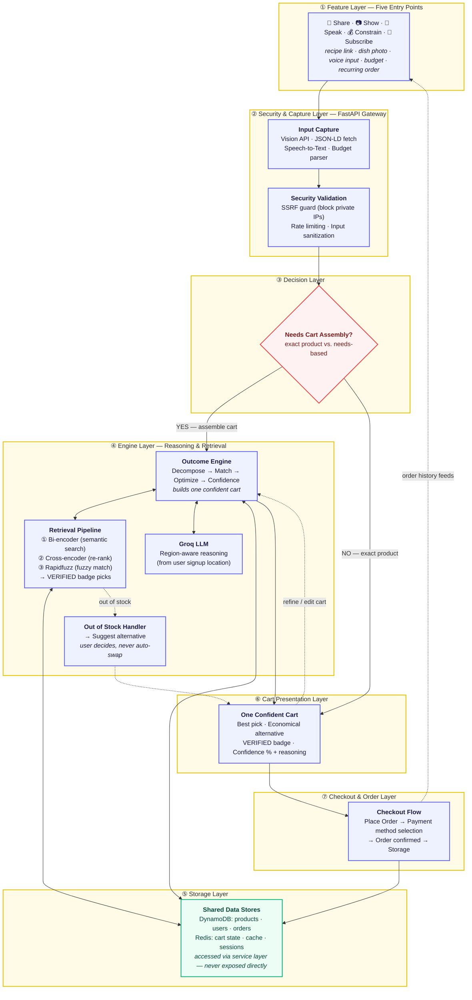

# NowCart — Hybrid System Architecture

> One engine, five doors, one confident cart, then checkout.
> Layer-by-layer hybrid diagram showing both high-level flow and key implementation details.

---

## Presentation Script (1 minute)

"Our system has **seven clean layers**. 

**① Feature Layer**: Five entry points — Share a link, Show a photo, Speak your need, Constrain by budget, or Subscribe for recurring orders. Each with a real-world example.

**② Security & Capture**: FastAPI gateway that captures input using Vision API, JSON-LD parsing, speech-to-text, and validates everything with SSRF guards and rate limiting.

**③ Decision Layer**: We decide — is this an exact product click, or does the user need us to build a cart?

**④ Engine Layer**: If they need assembly, our reasoning engine decomposes the request, runs it through a three-stage retrieval pipeline — bi-encoder for semantic search, cross-encoder for re-ranking, rapidfuzz for fuzzy matching — and uses a region-aware Groq LLM to optimize. Out-of-stock items trigger alternative suggestions, but the user always decides.

**⑤ Storage Layer**: Shared stores — DynamoDB for products, users, and orders; Redis for cart state and caching.

**⑥ Cart Layer**: We present one confident cart with the best pick, economical alternatives, verified badges, and confidence scores with reasoning.

**⑦ Checkout Layer**: User places the order, selects payment, and we confirm and persist to storage.

Dotted lines show optional paths — refining the cart loops back to the engine, and order history feeds subscription patterns."

---

## Key Implementation Details in This Hybrid Diagram

- **Layer 1**: Shows actual use cases (not just feature names)
- **Layer 2**: Reveals security mechanisms (SSRF, rate limiting) and capture technologies
- **Layer 4**: Breaks down the retrieval pipeline (bi-encoder → cross-encoder → fuzzy) and LLM reasoning
- **Layer 5**: Specifies storage technology and what each stores
- **Flows**: Main paths are solid, optional refinement/OOS paths are dotted
- **Clean separation**: Each layer has a clear responsibility without cluttering the visual space class Decision decide;
    class Buyer,Seller actor;