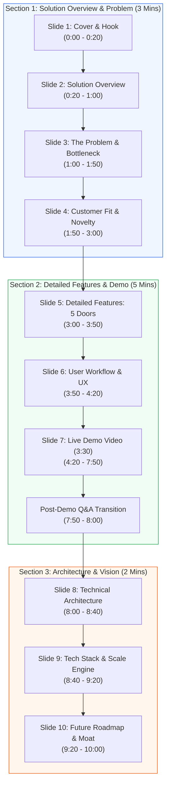

# NowCart Presentation Strategy & Slide Redesign

This document outlines the strategy, slide-by-slide layout, redesigned text content, visual diagrams, and speaker notes to transform your **NowCart** proposal into a premium, stage-ready presentation. 

It is designed to adopt the **Canva design principles** of the reference slide deck (PayBot/ArthSetu)—utilizing modular cards, color-coded badges, visual flows, and tables—while restructuring your approved content into a **Solution-First** flow optimized for a strict **10-minute judging window**.

---

## ⏱️ Timeline & Section Breakdown
To align with the judging criteria, the deck is split into three distinct blocks. The prototype demo is kept long (3:30 to 3:40 mins) to showcase your working code, while the slides cover the remaining time efficiently.

---

## 🎨 Canva-Inspired Design Principles
To replicate the premium aesthetic of the **PayBot/ArthSetu** deck:
1. **Container-Based Layouts**: Avoid plain bullet lists. Group related items into colored "cards" (light background on a dark theme or vice versa) with rounded borders.
2. **Visual Badging**: Use tags like `[NowCart Verified]`, `[Economical Alternative]`, and confidence percentages (`95% Match`) as visual badges.
3. **Numbered Steps & Nodes**: Use circular numbers (➊, ➋, ➌) for sequential flows to guide the judges' eyes.
4. **High-Contrast Typography**: Use strong sans-serif fonts (e.g., *Inter*, *Outfit*, or *Montserrat*) with heavy weights for titles and highlight metrics.
5. **No Walls of Text**: Turn explanations into a "Metric/Label + Short Subtext" format (e.g., **₹20T Locked** — Invoice delays lock up capital).

---

# Slide-by-Slide Strategy, Content & Script

---

## 🎬 Section 1: Solution, Problem & Expected Impact (3 Minutes)

### Slide 1: Cover Slide
* **Headline**: `HackOn with Amazon`
* **Sub-headline**: `NowCart — Reimagining Urgent Shopping`
* **Core Tagline**: `"Quick commerce solved 10-minute delivery. We solve the 10-minute decision."`
* **Design & Layout**:
  - Dark background (Navy/Charcoal) with a vibrant Amazon Orange secondary accent.
  - A clean vertical split: left side contains the title, tagline, and hackathon details; right side features a minimalist mock-up or logo placeholder.
  - **Team Details Container**: Team Codyssey (Rohan Singh, Anuj Kumar Yadav, Baibhav Kundu) in a clean footer card.
* **Speaker Notes (Time: 0:00 - 0:20)**:
  > *"Good morning, judges. We are Team Codyssey, and we are excited to present NowCart. Quick commerce has successfully perfected the 10-minute delivery, but it left cart-building completely unsolved. Today, we show you how we solve the deciding."*

---

### Slide 2: Solution Overview (NowCart)
* **Headline**: `NowCart: Reimagining Urgent Shopping`
* **Design & Layout**:
  - A clean, modern hero-style slide inspired by Canva reference layouts.
  - **Left Block**: Visual illustration of "Need ➔ Checkout-Ready Cart" (requirement-first shopping).
  - **Right Block**: High-level value propositions in a sleek two-card vertical layout.
* **Slide Content**:
  - **What is NowCart?** A universal reasoning layer built on top of any quick commerce catalog that turns a high-level user requirement into a complete, checkout-ready cart.
  - **Reversing the Flow**: Replaces the slow, traditional "Search ➔ Browse ➔ Add ➔ Repeat" steps with a direct, single-step "Requirement ➔ Cart" flow.
  - **Core Thesis**: We don't just solve delivery times; we solve the decision fatigue.
* **Speaker Notes (Time: 0:20 - 1:00)**:
  > *"Our solution is NowCart. NowCart is a universal reasoning layer that sits on top of any quick commerce catalog. Instead of forcing users to search for ten different ingredients, compare weights, and manage out-of-stock items manually, NowCart allows them to express a raw need—like a recipe, a budget, or a voice command—and instantly get a checkout-ready cart. We reverse the entire commerce experience from 'Product-First' to 'Requirement-First'."*

---

### Slide 3: Problem Statement & Market Relevance
* **Headline**: `The Bottleneck: The 10-Minute Decision`
* **Design & Layout**:
  - **Top strip**: Customer pain point scenario card (the "Priya" story) — a real user narrative that makes the stat numbers emotional and relatable.
  - Below: Left column with 3 numbered problem points + Right column "The Gap Nobody Fills" card.
  - Use circular number badges (➊, ➋, ➌) for the problem points, matching the PayBot layout.
* **Customer Pain Point Scenario** *(add as a highlighted strip at the top, before stats)*:
  > 😤 **A Real User's Thursday Evening**
  > Priya wants to cook Paneer Butter Masala tonight. She opens Blinkit, searches "paneer" — 12 results, 4 pack sizes, 3 brands. Picks one. Searches "tomato puree" — out of stock in her preferred brand. Searches again. Then butter, then cream, then spices — one by one. 7 minutes later, she's still building the cart. The food arrives in 10 minutes. **The deciding took just as long as the delivery.**
* **Slide Content**:
  * **Stats row** (3 callout boxes): 5–7 min wasted · ~70% abandonment · $7B+ market
  * **➊ Cart-building is the hidden bottleneck**: Every app makes users search item by item, compare 4–6 variants per product, and manually hunt substitutes when something is OOS.
  * **➋ OOS dead-ends drive permanent churn**: A user hits an out-of-stock item mid-cart. The app shows nothing. They close the app and open a competitor's. Every dead-end is a permanent trust loss.
  * **➌ Paradox of choice — no decision layer**: 6 variants of tomato puree. No platform tells you which one fits your recipe or budget. Users freeze and abandon.
  * **Quote card**: *"I know what I want to cook. I just don't want to spend 7 minutes searching for every single ingredient." — every household shopper, every time*
* **Speaker Notes (Time: 1:00 - 1:50)**:
  > *"Imagine Priya — she knows exactly what she wants to cook tonight, but she's spending 7 minutes building the cart item by item. Delivery takes 10 minutes. Deciding takes just as long. This is 300 million users, every day. 70% of those sessions end in cart abandonment — not because delivery is slow, but because the deciding is broken. NowCart closes that gap."*

---

### Slide 4: Customer Groups & Core Novelty
* **Headline**: `Customer Fit & What Makes Us Novel`
* **Design & Layout**:
  - A 4-column table (User Group / Real Pain Point / What Happens Today / NowCart's Answer) — adds the "what happens today" column to make the pain point visceral, not just descriptive.
  - Below the table: 3 novelty cards (Unique Angle / Informed Choice / No Single Point of Failure).
  - Bottom strip: "What they all need" highlight row.
* **Customer Table**:
  | User Group | Real Pain Point | What Happens Today | NowCart's Answer |
  | :--- | :--- | :--- | :--- |
  | **🧑‍🍳 Kitchen Novices** | Wants to cook a dish they saw on Instagram — no idea what ingredients to buy, in what quantity, or which brand | Googles the recipe, manually searches each ingredient, gives up halfway | **Show + Share**: Snap the dish or paste the YouTube link → full cart in seconds |
  | **👴 Elderly / Voice-First** | Wants basic groceries but can't navigate text-heavy apps — small buttons, typing, and search are genuine barriers | Asks a family member to order for them — dependent, slow, not independent | **Speak**: Say "dal chawal for 2" → cart appears. Zero typing, zero dependency. |
  | **🏠 Daily Household Shopper** | Knows what to cook but wastes 5–7 min searching, hitting OOS dead-ends, and comparing 6 variants per product | Cart abandoned 70% of the time — session ends in frustration, not checkout | **Constrain + Subscribe**: Budget-fit cart or auto-predicted restock, ready before they ask |
* **Bottom highlight**: *"Not a better search box — an interface that takes a raw need and hands back a ready cart. One missing item never breaks the flow. It's swapped with the next best match, transparently."*
* **Speaker Notes (Time: 1:50 - 3:00)**:
  > *"Three very different users, one identical problem. The kitchen novice gives up mid-search. The elderly user calls their kid to order for them. The daily shopper abandons the cart after hitting the third OOS dead-end. None of them need a better search box — they need an interface that understands the need and hands back a ready cart. Our novelty: intent in, cart out, with full transparency and no brand bias."*

---

## 📱 Section 2: Detailed Features & Demo (5 Minutes)

### Slide 5: Detailed Features: The Five Front Doors
* **Headline**: `The Five Front Doors: Multiple Intents, One Engine`
* **Design & Layout**:
  - Create **5 visual cards** arranged horizontally or as a 2x3 grid, representing the "Front Doors." 
  - Each card should feature a distinct icon (Camera, Link, Microphone, Wallet, Calendar) and a colored pill badge.
* **Slide Content**:
  * **[Show]** 📷 *Snap a dish photo* ➔ Gemini Vision identifies ingredients, LangGraph matches to catalog.
  * **[Share]** 🔗 *Paste a recipe link* ➔ System parses URL, LLM extracts ingredients, builds cart.
  * **[Speak]** 🎤 *Say "biryani for 4"* ➔ Semantic matching resolves intent & weights.
  * **[Constrain]** 💰 *Set a ₹500 budget* ➔ Knapsack optimizer trims and fits catalog matches.
  * **[Subscribe]** 🔁 *Predictive restock* ➔ Analyzes intervals, pre-builds cart before you ask.
* **Speaker Notes (Time: 3:00 - 3:50)**:
  > *"To deliver this experience, we built five specialized front doors that feed the same outcome engine. For instance, 'Show' processes a dish photo, 'Share' scrapes and parses recipe pages from any URL, 'Speak' understands multi-language voice commands like 'biryani for 4', 'Constrain' applies a knapsack algorithm to auto-fit budget caps, and 'Subscribe' predicts restocks based on historical shopping habits."*

---

### Slide 6: User Workflow & UX Concept
* **Headline**: `How It Flows: Express ➔ Engine ➔ Confirm`
* **Design & Layout**:
  - Horizontal flowchart showing the transition from input to output.
  - Use visual connectors. Label the middle stage as the `Outcome Engine (LangGraph Brain)`.
* **Slide Content**:
  * **Step 1: Express** (Choose any front door: speak, snap, paste, budget, or predict).
  * **Step 2: Engine** (Query decomposition ➔ Hybrid Retrieval ➔ Out-of-Stock handling ➔ Confidence scoring).
  * **Step 3: Confirm** (One confident cart presented with verified badges, alternative options, and a natural language refinement chat).
* **Speaker Notes (Time: 3:50 - 4:20)**:
  > *"To prepare you for the prototype demo, here is our 3-step workflow: Express, Engine, and Confirm. The user expresses their intent through one of the five front doors. The outcome engine decomposes the intent, searches the catalog, resolves out-of-stock items, and scores confidence. Finally, the user confirms one confident cart and can converse to refine it. Let's see this in action."*

---

### Slide 7: Working Prototype Demo (Video Embed)
* **Headline**: `Live Prototype Demonstration`
* **Design & Layout**:
  - **Embedded Video Container**: Keep the slide clean. Embed the 3:30 - 3:40 minute demo video inside a mock tablet or laptop frame.
  - Add a small text caption at the bottom: `📊 Live deployed on AWS. Test account: rahul@gmail.com`
* **Slide Content**:
  - **Relevance Ranking**: Semantic matches are sorted by confidence.
  - **Substitution Logic**: If an item is out of stock, NowCart suggests the next best match instead of throwing a dead-end error.
  - **Refinement Layer**: User can type "make it vegan" or "remove garlic" to dynamically rebuild the cart.
* **Speaker Notes (Time: 4:20 - 7:50)**:
  > *(Voiceover during the video. Narrate each feature as it happens in the demo)*:
  > *"In this demo, you can see our actual live deployment. First, we snap a photo of Paneer Butter Masala. The system immediately extracts the dish and matches the catalog. Next, we paste a YouTube recipe link—notice how the ingredients are extracted in real-time. Finally, watch us voice command a cart with a hard ₹500 budget limit, and see how the greedy knapsack algorithm automatically selects the highest-scoring essentials to fit the price limit."*

* **Post-Demo Q&A Transition (Time: 7:50 - 8:00)**:
  > *"Notice how the interface handles out-of-stock items: it doesn't fail; it suggests the next best match. The user can also type 'make it vegan' or 'remove garlic' to dynamically rebuild the cart conversationally, ensuring zero friction before checking out. Now, let's look at the underlying tech."*

---

## ⚙️ Section 3: Technical Architecture & Future Vision (2 Minutes)

### Slide 8: Technical Architecture
* **Headline**: `System Architecture: End-to-End Reasoning`
* **Design & Layout**:
  - Insert the **7-Layer Hybrid Diagram** from your `archi.md`. 
  - Ensure the layers are color-coded: Feature Layer (Blue), Security & Gateway (Amber), Engine & LLM (Blue/Grey), Storage (Green).
  - Use dashed lines to show conditional feedback loops (e.g., refinement, order history feeding subscription).
* **Slide Content**:
  * **1. Feature Layer**: 5 entry points feeding a single API gateway.
  * **2. Security & Capture**: SSRF validation, rate limiting, and raw input parsing.
  * **3. Decision Layer**: Routing between exact matching vs. assembly requests.
  * **4. Engine Layer**: LangGraph outcome engine orchestrating the hybrid retrieval pipeline (Bi-encoder ➔ Cross-encoder ➔ Rapidfuzz).
  * **5. Storage & Checkout**: Latency-optimized caches and transactional databases.
* **Speaker Notes (Time: 8:00 - 8:40)**:
  > *"Under the hood is a secure, 7-layer architecture. Inputs pass through our FastAPI security gateway with SSRF guards. Our LangGraph engine maps raw requests into a 3-stage retrieval pipeline—combining semantic bi-encoders, cross-encoder re-ranking, and fuzzy string matching. This provides a highly accurate semantic match against the catalog."*

---

### Slide 9: Tech Stack & Key Algorithms
* **Headline**: `Tech Stack, Key Algorithms & Scaling`
* **Design & Layout**:
  - A clean 2-column comparison table, drawing inspiration from PayBot's "Tech Stack" slide.
* **Slide Content**:
  | Layer | Technology | Key Scalability Detail |
  | :--- | :--- | :--- |
  | **Frontend** | React 19 + Vite + TailwindCSS | Zero-lag rendering, fast mobile load |
  | **Backend** | FastAPI + Pydantic 2 | Async request handling, strict validation |
  | **AI / ML** | LangGraph + Groq (Llama 3.3) / Gemini | Multi-agent reasoning with LLM response caching |
  | **Storage** | DynamoDB + Redis | Serverless scaling, sub-ms query cache |
  | **Infra** | AWS S3 + CloudFront + SQS Lambda | AI computation decoupled from core API thread |
* **Speaker Notes (Time: 8:40 - 9:20)**:
  > *"Our stack is built for high-scale, low-latency production. We use React 19 and FastAPI for fully asynchronous operations. AI tasks are offloaded to AWS Lambda via SQS, decoupling heavy reasoning execution from API response times. Repeated queries are cached via Redis, resulting in sub-millisecond response times and lowering LLM costs by up to 99%."*

---

### Slide 10: Expected Impact & Future Vision
* **Headline**: `Future Vision & Scaling Roadmap`
* **Design & Layout**:
  - Left column: The 3-phase horizontal milestone roadmap.
  - Right column: The vertical expansion pathways (Health, Social, B2B) with metric callouts.
* **Slide Content**:
  * **Roadmap Horizons**:
    - **0-3 Months**: Grocery intent-capture live in one metro (1K active users target).
    - **3-6 Months**: Pharmacy catalog integration + multi-lingual voice support.
    - **6-12 Months**: B2B Restocking API & white-label licensing.
  * **Multi-Segment Expansion**:
    - **Pharmacy & Health**: "Child has a fever" ➔ OTC & hydration cart.
    - **Creator Commerce**: Cookbooks/Videos ➔ One-click checkout cart.
    - **B2B Restocking**: Restaurants & offices ➔ Bulk quantity & budget constraints.
* **Speaker Notes (Time: 9:20 - 10:00)**:
  > *"Looking ahead, NowCart is category-agnostic. Adding a new sector—like pharmacy or creator commerce—requires a catalog update, not an architectural rewrite. In the next 3 months, we target 1,000 active grocery users. Within a year, we plan to roll out white-label APIs for commercial platforms, transforming NowCart into the universal 'need-to-done' checkout layer. Thank you, we are now open for questions."*

---

## 🛠️ Action Items for Slide Creation

1. **Keep the Existing Tables & Diagrams**: The Tech Stack table (Slide 9) and the System Architecture diagram (Slide 8) are excellent. Keep them but apply the new styling (rounded cards, unified color codes).
2. **First Explain the Solution**: Make sure Slide 2 (The Solution) is shown *before* Slide 3 (The Problem). This solution-first approach immediately builds excitement before highlighting the friction details.
3. **Embed the Demo Video**: When placing the video on Slide 6, make sure it is embedded directly in your PowerPoint or Canva file to prevent switching windows on stage, which appears unprofessional.
4. **Practice the Flow**: Use the provided timing triggers to ensure you do not have to jump back and forth between slides. Each slide contains a complete logical block of your narrative.
